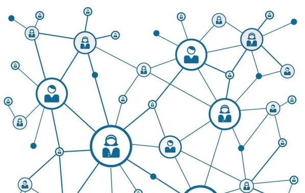

In recent years, new members are joining the _Bitcoin/Altcoins_ community, not for any ideological reason but practical ones.
Whether or not bitcoin will be worth millions isn’t the main question for many computer scientists, investors, and entrepreneurs.
To them, Satoshi Nakamoto’s real invention is the _Blockchain Technology_--a global open ledger which can be used to share much more than just money.

While the original purpose of the blockchain technology is powering bitcoin, it is capable of so much more.
Blockchain is a suite of distributed ledger that can be programmed to record and track anything of value,
be it records of contracts, financial transactions, land titles/deeds, medical records, etc. Thus, bitcoin isn’t just
another way to pay for stuff online, rather it’s a denomination used to pave the tool to put stuff on a global ledger.

To understand what makes this technology special or any different from the existing systems we have in place,
I’d touch on the internals of bitcoin.

### Bitcoin

Bitcoins is a stateless, “algorithmic” currency that exists only in cyberspace.

It all started in October 2008, when Satoshi Nakamoto, a software engineer who was never identified,
published a paper outlining a “peer-to-peer electronic cash system” <a href="https://bitcoin.org/bitcoin.pdf" target="_blank" class="read-more">_(Read paper)_</a>.

Just as precious metals are dug from the earth, bitcoins are mined from blocks. Blocks are ledgers that contain
a complex mathematical problem that, if solved, will reward its solvers with a number of bitcoins.

> There’re only twenty-one million Bitcoins to be mined.

Bitcoin mining is the process of adding transaction records to bitcoin’s public ledger of past transactions,
called the blockchain (chain of blocks)--a shared public ledger on which the entire decentralised distributed peer-to-peer
bitcoin network relies. All the bitcoin used in the world are connected and together they constitute a network that processes
and check all bitcoin transactions in a public ledger.

Satoshi Nakamoto designed the blockchain in such a way that users can create a free and anonymous bitcoin account number--a wallet.
This eliminates the need for a central bank because all the users constitute the bank.

> A decentralised blockchain makes it possible to share data publicly without a single party controlling the system.

### Banking system vs Bitcoin

Modern paper currencies are fiat currencies, and we know that the fiat monetary system is flawed <a href="https://news.bitcoin.com/how-fiat-money-fails-deconstructing-the-governments-paper-thin-promise/" target="_blank" class="read-more">_(Read more)_</a>.

Historically, the government would mint coins out of valuable materials, such as gold or silver, or print paper money that could
be redeemed for a set amount of gold or silver.

Because fiat money is not linked to physical reserves, such as a national stockpile of gold or silver,
it risks losing value due to inflation or even becoming worthless in the event of hyperinflation--Zimbabwe as a perfect example.

Although if you created an entire society that is reliant on bitcoin, you’d have massive inequalities,
it’s imperative that it forms a counterpart to the existing banking system--that bank on the fiat monetary system.

Right now, the banking system has moved to the concept of cashless-society, meaning that every single payment you make goes
via a commercial bank--so every single transaction is being monitored and recorded in a database. And you’ll always pay some
kind of fees to the commercial banks/credit card companies.

Bitcoin made the cashless society possible without the need for a third-party.

### Blockchain

> The blockchain is an incorruptible digital ledger of economic transactions that can be programmed to record not just financial transactions but virtually everything of value.”
> -- Don & Alex Tapscott, authors Blockchain Revolution (2016).

#### How Blockchain Works

Blockchain stores information in batches, called blocks, that are linked together in chronological order to form a continuous
chain of blocks. To make a change to the information on a block, you don't update it. Instead, the change is stored in a newly
created block showing the change with the time it occurred, just like the traditional accounting ledger.
This way stored records are _immutable_.

Unlike the normal accounting ledger, whose data is recorded in a book or a single database system, blockchain uses a
_distributed database_ system across a large network of computers, such that each block has access to the entire database,
including its complete history. Thus, curbing the ability of data tampering, and creating trust in the data.

Before a block can be added to a chain, a few things have to happen. First, a complex mathematical problem must be solved,
thus creating the block. The computer that solves the problem shares the solution to all other computers on the network.
This is called a proof-of-work. The network verifies the proof-of-work, if correct, the block is added to the chain.

#### How Organisations are already using Blockchains

We've seen major banks, e-commerce giants and other industries experimenting with blockchain for money transfers, keeping records,
and other complex backend functions. As an un-alterable ledger in real-time, it enables them to track documentation
and authenticate ownership of assets digitally.

Here are some real-world examples of blockchain technology in action:
 * **Cutting out the middle man**: Companies like Uber, Airbnb and Expedia act as aggregators, i.e. a centralised platform that
 connects providers of a service with customers who need that service. The centralised aggregator is the one in control here;
 they set their own terms and conditions, and, naturally, take a cut of each transaction as their fee. Blockchains are now
 being used to cut out the middleman and create a secure, decentralised way for service providers and customers to connect and
 transact safely and directly.

 * **Improving healthcare**: Blockchain provider SimplyVital Health has already created two blockchain products that are designed to
 improve healthcare management. The first, ConnectingCare, tracks the progress of patients after they leave hospital, and the second,
 Health Nexus, is designed to provide decentralised blockchain patient records. Elsewhere, startup company Gem is working with the
 Centre for Disease Control to build a blockchain for storing disease outbreak data, in the hopes of increasing the effectiveness of
 disaster relief.

 * **Better banking and transactions**: Barclays has already launched a number of blockchain initiatives for, among other things,
 tracking financial transactions and combating fraud, and Bank Hapoalim is collaborating with Microsoft to create a blockchain for
 managing bank guarantees. In another example, Aeternity’s blockchain platform allows users to create smart contracts that become
 active when certain conditions have been met, which means automated payments can be released when parties in a transaction agree
 that their conditions have been met.

 * **Smarter supply chains**: Knowing the status, condition and provenance of every product on your supply chain is key for
 businesses--and, for consumers, provenance is becoming an increasingly important issue. DeBeers is planning to use blockchain technology to
 trace diamonds all the way from the mine to the end customer, which will increase transparency and allow customers to verify that
 their diamonds are free from conflict <a href="https://bernardmarr.com/default.asp?contentID=1788" target="_blank" class="read-more">_(Read more applications here)_</a>.

###
•••

With blockchain, we can imagine a world in which contracts are embedded in digital code and stored in transparent,
shared databases, where they are protected from deletion, tampering, and revision. In this world, every agreement,
every process, every task, and every payment would have a digital record and signature that could be identified, validated,
stored, and shared. Intermediaries like lawyers, brokers, and bankers might no longer be necessary. Individuals, organizations,
machines, and algorithms would freely transact and interact with one another with little friction. This is the immense potential
of blockchain <a href="https://hbr.org/2017/01/the-truth-about-blockchain" target="_blank" class="read-more">_(Read more)_</a>.

Blockchain technology brings everyone to the highest degree of accountability. With the help of this technology no more
transactions will be missed, human or machine errors will be minimised.

Just like all good things, blockchain to has got some challenges: it requires high computing resources/power to operate;
and in the case of bitcoin/altcoins, it's important you secure your wallet ID, as revealing it to a third party means losing
control over your coin value, and also, if you forget your wallet ID it cannot be recovered and the funds secured by it are
lost forever.

