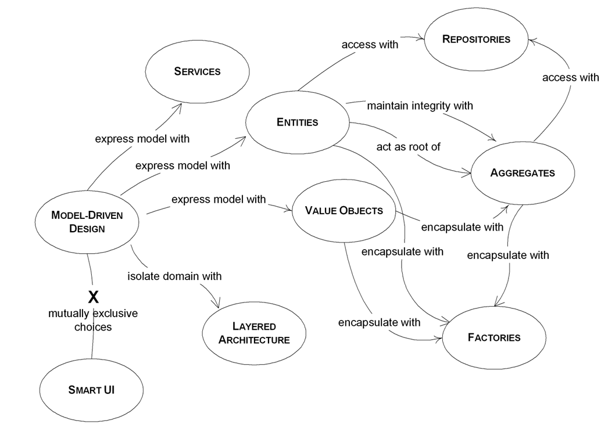
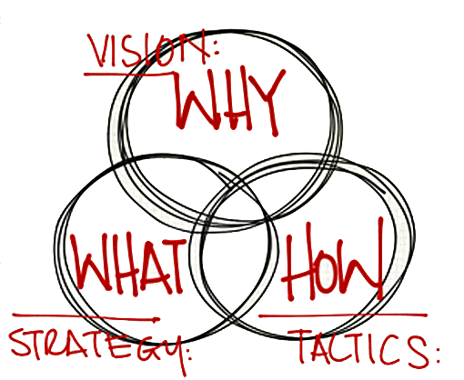
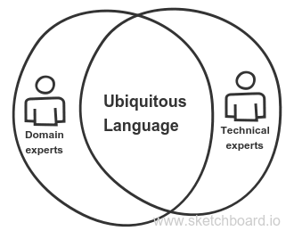
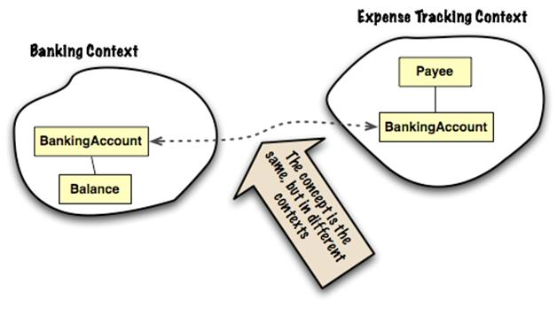

An old chess saying goes as follows: “tactics is knowing what to do when there’s something to do, while strategy is knowing what to do when there’s nothing to do”. Although this statement is somewhat exaggerated, a more nuanced distinction might be that tactics represent the specific means used to achieve an objective, while strategy refers to the comprehensive campaign plan. This plan may involve complex operational patterns, activities, and decision-making processes that guide tactical execution.

Building software without starting with the end in mind is synonymous to not having a strategy in place. Most developers tend to focus more on the technical details than solving the actual business needs—tactics without strategy.

> Why though? Of course, because strategy is hard, tactics are easier, and people prefer easier tasks.

Enter Domain-Driven Design (DDD), an approach to software development first described by Eric Evans—a collection of principles and patterns that help developers craft elegant object systems. Properly applied it can lead to software abstractions called domain models. These models encapsulate complex business logic, closing the gap between business reality and code.

In a simple term, DDD helps to make software deeply reflect a real-world system or process. For example, let’s try and model a bank saving account.

### Modelling a Bank Saving Account

Without DDD, a naive developer might model a savings account as a calculator, where one can add to a balance and subtract from a balance. That’s the simplest thing that could work, everything else is built upon that concept, right?

In an actual sense, what a savings account is, is a process that does an iteration over an audit trail of database transactions, of deposits and interest gatherings, and other shifts of the money. It’s not like it’s some money sitting on the shelf on a bank somewhere... There are these relatively intricate structures in the foundations of a banking system to support the tax people, the actuaries, etc, that the developers cannot think of beforehand.

To create good software, you have to know what that software is all about. You cannot create a banking software system unless you have a good understanding of what banking is all about—understanding the banking domain. The banking system is very well understood by bankers, thus you need their help. DDD helps us create models of a problem domain. And the model here is a set of just enough concepts selected to be implemented by the developer as software artefacts.

To accomplish this, DDD advocates that the domain experts—the banker in our case—and the developer consciously communicate the domain in other to build a model. This is done in a way that the domain experts don’t ask for what he wants to see in the implementation, like describing a new user story in terms of a field on a screen or a menu item, and whatnot; they talk about the underlying property or behaviour that’s required on a domain object. Similarly, the developers don’t talk about new instance variables of a class or columns in a database table.

> A Domain Model is an Object Model describing the problem domain. They include the domain objects in the problem domain and describe the attributes, behaviour and relationships between them.

### Ubiquitous language

Once the domain expert and the developer are done discussing the domain subject, they get to develop a ubiquitous language: Here we talk about a language that is used by all the team members to connect the activities of the team with the software. The ubiquitous language of DDD helps when it comes to knowing more about terms that are used by the business experts. The tech team can know if the language changes and if a specific term will be used for a different meaning. Once this has been established then the new field on the screen or column in the database table follows on from that.

### Models and Context

A model is always within a context of a sort; the context is a setting that determines the meaning of a statement—they’re mostly inferred by the end-user that use the system. For the savings account system, the tellers relate to some concepts/terminologies of the modelled domain in a different way than regular customers can grasp. This is referred to as bounded context in DDD.

The Bounded context (BC) is the context in which the ubiquitous language and the corresponding models are valid. It gives the team a clear understanding of what has to be consistent and what can develop independently. Every domain model lives in precisely one BC, and a BC contains precisely one domain model.

> Bounded Context is where Ubiquitous Language lives.

A graph that connects different contexts, is called a context map. For each context, you find a language, an independent implementation and an interface to talk to other bounded contexts. A context map helps us understand the nature of each bounded context dependencies.

The image above depicts a very simple Context Map: drawing contours around portions of the domain model shows the areas where conceptual integrity is preserved <a href="https://www.infoq.com/articles/ddd-contextmapping" target="_blank" class="read-more">_(Read more)_</a>.

In this case, the two contexts have some logical overlapping area: the concept of banking account is used in different ways in different portions of the application, meaning that we’ll have different models in play. However, the two models are probably going to interact closely. Besides preserving the conceptual integrity of the model within the context boundaries, the context map helps us focus on what’s happening between the different contexts. In this case, assuming that the same team is working on both contexts, we need everybody in the team to be aware of the two different contexts, eventually sharing a translation map, for the terms and concepts that appear in both models.

### An over-simplified version of Eric’s book

In summary, these are the main concept of Eric’s book:

- Knowledge crunching
- Ubiquitous language
- Model-driven design
- Implementation patterns (entity, aggregate, aggregate root, value object, strategy, domain service, domain event, repository, etc)
- Supple design, Refactoring towards deeper insight
- Strategic design (bounded context, context map, core domain, subdomains).
  Although you’ll most likely have to read the book to understand most of the jargons. My writeup is merely a brief introduction to the DDD concept.

<a href="https://www.amazon.com/Domain-Driven-Design-Tackling-Complexity-Software/dp/0321125215" target="_blank">Get the book here</a>.
