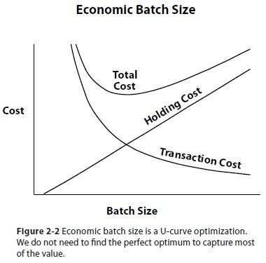
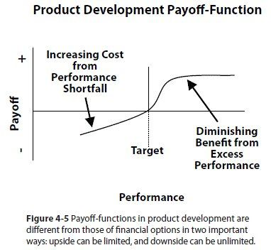

_The Principles of Product Development Flow_ by Donald Reinertsen is a book on Lean Product Development that systematically applies the theories and best practices of economics, lean manufacturing, queuing theory, statistics, etc, to the product development process. 

Reinertsen summarises the theories above in 8 core themes and 175 principles, with tons of examples and graphs to illustrate the concepts.

The book, albeit 300 pages, is dense. Reinertsen takes a rigorous approach on how to manage product development processes. Thus any attempt to summarise it will be inadequate. So I'll try to give a bird's-eye view of the major concepts, then go a bit deeper into the concept of _managing queues_.

### The Principles of Product Development Flow

To fully get a grasp of the book you'd need to be familiar with concepts such as lean manufacturing, economics, and operations research. Lean manufacturing, Toyota Production System, theory of constraints, and other technical sources are briefly referenced.

Reinertsen discusses how queuing theory manages delays, how project and task cycle times drive the cost of delay, how long queues increase defects, variability, and risks. How misplaced high efficiency and utilization goals lead to delays, increased costs, and disastrous momentum. 

Queues are everywhere in product development.

Let's take a look at each major concept in brief.

#### The Economic View

This chapter is about attributing economic value to the work we do as product developers. He points out that we often use proxy measurements that offer little or no economic connection with the marketplace.

>As Eric Ries puts it in his review <a href="http://www.startuplessonslearned.com/2009/07/principles-of-product-development-flow.html" target="_blank" class="read-more">_(here)_</a>: The goal [of the book] is to help us recognize that every artifact of our product development process is really just a proxy variable. Everything: schedules, efficiency, throughput, even quality. In order to trade them off against each other, we have to convert their impact into economic terms. They are all proxies for our real goal, maximizing an economic variable like profit or revenue. Therefore, in order to maximize the true productivity (aka profitability) of our development efforts, we need to understand the relationships between these proxy variables.

Two important points from this chapter:
* If you only measure one thing, measure the cost of delay
* Measure the work, never the worker

Most economic factors in product developement can be traced back to managing delay. Once we quantify the cost of delay, we become aware of the cost of queues. 

Although, this does not mean that we should spend extensive effort and time on computing the economic value of everything in the product development process. Reinertsen argues that just getting close delivers almost all of the value of measurement with a fraction of the effort.

The graph above shows a classic example of batch size optimization which trades off a hyperbolic function against a linear function. Knowing that important optimizations take this form is surprisingly useful because the U-curves have two important properties. First, optimization never occurs at extreme values. If optimization occurred at extreme values, then quantification would be unnecessary. We would only need to know the direction that maximizes performance. In contrast, U-curve optimizations virtually always require quantification, because we must balance two or more competing factors. 

We'll see an example of this in a bit.

#### Exploiting Variability

Reinertsen discusses that variability is not always a bad thing in product development. Although, even as Agile development draws from the same concept, we must be very careful not to take too much with us. We should be careful of sudden variations that affect the original plan that benefit the product.

Measure variability with a payoff function. Use statistics-based steps to reduce variation, such as smaller tasks and time limits. Minimize the impact of variability by economic prioritisation, faster iterations, and early high-risk actions. 

In product development, there comes a point at which additional features cost more than the benefit that is derived from them. By apply economic principles to the value of features, we can quantify their benefits, and properly assess whether additional features make economic sense.

#### Enable Smaller Batches

Smaller task batch sizes reduce variability and cycle time, accelerate feedback, improve engagement, and reduce risk and overhead. Large batches increase costs, delay progress, and may become unmanageable. 

Using trial and error, we can get the optimum batch sizes. Smaller batch sizes are more beneficial than capacity increases. Large batch sizes impact every step of product development.

Big iterations require big queues. Reducing batches can have many benefits in a software development environment. Here is an example pulled from the book for the testing portion of software development.

The batch size chapter reiterates the concepts of Agile or Lean principles: colocation, short iterations, low hanging fruit, and modular design are all discussed. While none of these ideas is new, it is valuable to read about them in the context of maximizing economic value.

#### Control WIP and start rates

The chapter on WIP discusses how costs can be minimized by controlling work-in-progress. Detailed planning and control of tasks are costly. It is more effective to control the work in process between major functions. 

As with Toyota Production System or Theory of Constraints, managing the flow of released products from stage to stage improves final results. Many scheduling, prioritization, resource, and recovery strategies can minimize task WIP.

#### Controlling Flow Under Uncertainty

The flow of activities through product development can be managed. Use forecasts and share information between adjacent stages. Use cadence to set routine start/stop times. Sequence tasks and change priorities based upon risk and incremental economic value added.

#### Accelerate Feedback

Develop rapid feedback systems. Employ early warning systems and value at risk triggers to escalate reviews. Align activities through training, incentives, and templates. Adjust decisively when required. Use frequent communication to build teams and short queues to build urgency. Employ flow metrics.

#### Decentralize Control

Decentralize decision-making to speed the flow and avoid management bottlenecks. Provide high-level structure in the form of rough-cut plans, rules of thumb, intentions, templates, and sequences.

######
***

### Introduction to Queueing Theory

Queueing Theory (QT) is the study of waiting lines. It assists businesses in determining the optimal level of service to provide to minimize costs.  
_<small>[If you have a basic knowledge of QT, skip to the next section -- [managing queues](#managing-queue).]</small>_ 

A queuing situation involves two parts.
1. Someone or something that requests a service -- usually referred to as the customer, job, or request.
2. Someone or something that completes or delivers the services -- usually referred to as the server.

QT enables mathematical analysis of several related processes, including arrival at the back of the queue, waiting in the queue, and provision of service at the front of the queue. The derivation and calculation of several key performance measures including the average waiting time in the queue, the expected number queuing for service, and the probability of the system in certain states such as empty or full. It explores the relationship between the demand on a service system and the delay of services based upon the con

We can see that variations are the primary cause of queues. There are two kinds, arrival and service variations.

>Businesses utilize queuing models to minimize total cost, by balancing service and waiting costs. Cost of providing services and cost of not providing services.

#### Visually Minimizing Queues Costs

Let's take an example: _Mr X who owns a coffee shop would like to know the average number of customers queuing in his shop, to decide whether he needs to add more space to accommodate more customers._

Using QT, we can create a simple graph of service level (the number of baristas to hire), vs the cost of operating the coffee shop.

The following applies to the problems:
* The service cost will be a liner line that increases with each additional server we decide to add.
* The waiting cost will be a non-linear line because if we only have one server, we can have a really long line, whereas by adding an additional server, we could probably handle all waiting customers. Now, adding one more might be a waste, as the two servers are already operating at an optimal level.

From the graph above, Mr X concern is the total cost of operation. 

_
**Total Expected Cost = Service Cost + Waiting Cost**
_

What he needs to do is locate the minimum of that total expected cost, which is where the service cost and waiting cost intersect. That's the optimal level.

#### Kendall Notation

Queuing theory uses the Kendall notation to classify the different types of queuing systems (or nodes). Queuing nodes are classified using the notation A/S/c/K/N/D where:
* A is the arrival process
* S is the mathematical distribution of the service time
* c is the number of servers
* K is the capacity of the queue, omitted if unlimited
* N is the number of possible customers, omitted if unlimited
* D is the queuing discipline, assumed first-in-first-out if omitted

#### Little’s Law

Little’s Law connects the capacity of a queuing system, the average time spent in the system, and the average arrival rate into the system without knowing any other features of the queue. The formula is quite simple and is written as follows: 
					
_
**L = λW**
_           

Where:
* L is the average number of customers in the system
* λ (lambda) is the average arrival rate into the system
* W is the average amount of time spent in the system

Project management processes like Lean and Kanban wouldn’t exist without Little’s Law <a href="https://www.process.st/littles-law/" target="_blank" class="read-more">_(read more)_</a>. They’re critical for business applications.

_
**Work In Progress = Throughput * Lead Time**
_

###  Managing Queues 

Product developers have an idea that if people work all the time, product features get delivered faster. As a result, they go to high utilization, and unfortunately, they don't measure or manage the queue in their process. 

We can see this vividly at play in manufacturing, where a queue is a physical object. If a queue doubles in a factory in one week, you see piles of stuff on the factory floor. This is unlike an engineering department where the queue is intrinsically invisible information -- piles of bits on a disk drive.

>Invisible and unmanaged queues are the root cause of poor economic performance in product development. 

Underestimating the cost of queues in product development leads to process overloading. You can see that in the brief introduction to queuing theory above. Queues affect capacity utilization. As queue size increases, we tend to apply more of our capacity to alleviate the situation. This increased capacity utilization reduces our flexibility.

Queues in a given process occur right before a step with limited capacity and/or high utilization (Product management, Engineering, QA). Capacity utilization is the single most important factor in the occurrence of queues. This is somewhat natural because when a process is run at 100% utilization, any new work would automatically sit on the “waiting” queue until someone has the free capacity to take it.

The interesting part is that capacity utilization affects the size of the queue exponentially: going from 80% utilization to 90% utilization would double the queue size; going from 90% to 95% will double it once again. Since the queue size also affects the cycle time of each new job, you have to be careful what percent utilization you operate your processes on. If cycle time is important -- choose lower utilization, which would guarantee a quick turnaround time for important new tasks.

Also, it is important to note that queues are not always bad, and whether you should allow a queue of a given size to occur is an economical question. If an extra developer costs you _N_, but the potential delay of the project costs you _100 x N_, then it might be wise that you just get the developer and zero down the development queue. However, if you need to spend a lot of money to shorten the test cycle by one week and the benefit would be a mere pat on the back, then that shouldn't count.

If you have a process or a staff that affects the overall throughput of the system (bottleneck), you don’t want any idle time for them. To make sure they always have something to work on, you deliberately build a queue right before them. This queue takes away the variation of arriving new tasks and ensures maximum throughput for your process.

#### Queues in Product Management 

Product management happens to have a big queue of non-refined ideas collected by the team or other teams. A lot of ideas could propel the company to the next level, as long as product management has the capacity to refine them into real business cases and work with the engineering teams to realize them. Failing to do so results in a lot of missed opportunities or sometimes direct losses, when customers churn because their feedback was not heard.

This is the right place to say that implementing a FIFO (first in first out) scheduling algorithm for product management (like the one lean people use in manufacturing) might be a really bad mistake. One of the methods to minimize the economic losses caused by queues is to sequence the jobs in the most economically feasible order. 

If you have a very critical job, that might lead to a lot of extra costs if delayed, you may want to schedule it before many others, that have no such risk associated with them. If you have two such jobs, you may want to start with the shorter one.

### In Conclusion

Managing Queues is the key to improving product development economics. Queues create longer cycle time, lower quality, more variability, increased risk, more overhead, and less motivation.

<small>References: <a href="https://www.amazon.com/gp/product/1935401009" target="_blank">The Principles of Product Development Flow by Donald Reinertsen</a>; <a href="https://www.bptrends.com/principles-of-product-development-flow-second-generation-lean-product-development-by-donald-g-reinertsten/" target="_blank">Bptrends book summary</a>; <a href="https://kanbanize.com/blog/economic-problem-with-queues-product-development/" target="_blank">The Economic Problem with Queues in Product Development.</a>
</small>