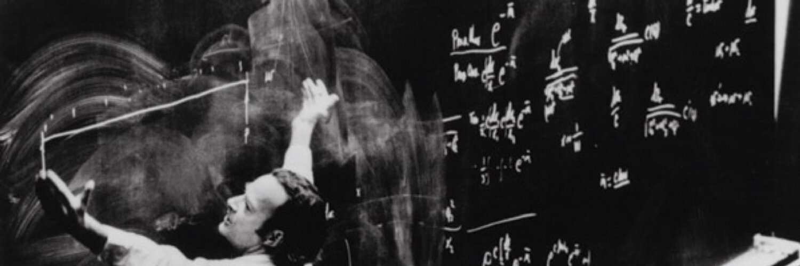

Here is part five of the Naval’s expanded points from his viral tweetstorm, “How To Get Rich Without Getting Lucky” <a href="/how-to-get-rich-without-getting-lucky-summary" class="read-more">_(Read summarised article here)_</a>.

### There’s No Actual Skill Called “Business”

In that sense, business to me is bottom of the barrel. There’s no actual skill called business, it’s too generic. It’s like a skill called “relating.” Like “relating to humans.” That’s not a skill, it’s too broad.

A lot of what goes on in business schools, and there is some very intelligent stuff taught in business schools—I don’t mean to detract from them completely—some of the things taught in business school are just anecdotes. They call them “case studies.”

But they’re just anecdotes, and they’re trying to help you pattern match by throwing lots of data points at you, but the reality is, you will never understand them fully until you’re actually in that position yourself.

Even then you will find that basic concepts from game theory, psychology, ethics, mathematics, computers, and logic will serve you much, much better.

I would focus on the foundations, I would focus with a science bent. I would develop a love for reading, including by reading so-called junk food that you’re not supposed to read. You don’t have to read the classics. That [reading] is the foundation for your self-education.

### Doing is faster than watching

When it comes to your learning curve, if you want to optimize your learning curve... One of the reasons why I don’t love podcasts, even though I’m a generator of podcasts, is that I like to consume my information very quickly.

And I’m a good reader, or a fast reader and I can read very fast but I can only listen at a certain speed. I know people listen at 2x, 3x, but everyone sounds like a chipmunk and it’s hard to go back, it’s hard to highlight, it’s hard to pinpoint snippets and save them in your notebook, and so on.

Similarly, a lot of people think they can become really skilled at something by watching others do it, or even by reading about others doing it. And going back to the business school case study, that’s a classic example.

They study other people’s businesses, but in reality, you’re going to learn a lot more about running a business by operating your own lemonade stand or equivalent. Or even opening a little retail store down the street.

That is how you’re going to learn on the job because a lot of the subtleties don’t express themselves until you’re actually in the business.

For example, everyone’s into mental models these days. You go to Farnam Street, you go to Poor Charlie’s Almanack, and you can learn all the different mental models. But which ones matter more? Which ones do you apply more often? Which ones matter in which circumstances? That’s actually the hard part.

For example, my personal learning has been that the principal-agent problem drives so much in this world. It’s an incentives problem. I’ve learned that tit-for-tat iterated prisoner’s dilemma is the piece of game theory that is worth knowing the most. You can almost put down the game theory book after that.

By the way, the best way to learn game theory is to play lots of games. I never even read game theory books. I consider myself extremely good at game theory. I’ve never opened up a game theory book and found a result in there where I didn’t think, “Oh, yeah, that’s common sense to me.”

The reason is that I grew up playing all kinds of games and I ran into all kinds of corner cases with all kinds of friends, and so it’s just second nature to me. You can always learn better by doing it on the job.

### The number of “doing” iterations drives the learning curve

But doing is a subtle thing. Doing encapsulates a lot. For example, let’s say, I want to learn how to run a business. Well, if I start a business where I go in every day and I’m doing the same thing, let’s say I’m running a retail store down the street where I’m stocking the shelves with food and liquor every single day, I’m not going to learn that much because I’m repeating things a lot.

So, I’m putting in thousands of hours, but they are thousands of hours doing the same thing. Whereas if I was putting in thousands of iterations, that would be different. So, the learning curve is across iterations [not iterations].

So if I was trying new marketing experiments in the store all the time, I was constantly changing up the inventory, I was constantly changing up the branding and the messaging, I was constantly changing the sign, I was constantly changing the online channels that are used to drive foot traffic in, I was experimenting with being open at different hours, I had the ability to walk around and talk to other store owners and getting their books and figure out how they run their businesses.

It’s the number of iterations that drives the learning curve. So, the more iterations you can have, the more shots on goal you can have, the faster you’re going to learn. It’s not just about the hours put in.

### If you’re willing to bleed a little every day, you may win big later

It’s actually a combination of the two, but I think just the way we’re built and the way that the world presents itself, the world offers us very easily the opportunity to do the same thing over and over and over again. But really, we’d be better served if we went off and found ways to do new things from scratch.

And doing something new the first time is painful, because you’re wandering into uncertain territory and high odds are that you will fail. So you just have to get very, very comfortable with frequent small failures.

Nassim Taleb talks about this also. He made his fortune, his wealth by being a trader who basically relied upon black swans. Nassim Taleb made money by losing little bits of money every day and then once in a blue moon he would make a lot of money when the unthinkable happened for other people.

Whereas most people want to make little bits of money every day and in exchange they’ll tolerate lots of blow-up risk, they’ll tolerate going completely bankrupt.

We’re not evolved to bleed a little bit every day. If you’re out in the natural environment, and you get a cut and you’re literally bleeding a little bit every day, you will eventually die. You’ll have to stop that cut.

We’re evolved for small victories all the time but that becomes very expensive. That’s where the crowd is. That’s where the herd is. So, if you’re willing to bleed a little bit every day but in exchange you’ll win big later, you will do better.

That is, by the way, entrepreneurship. Entrepreneurs bleed every day.

They’re not making money, they’re losing money, they’re constantly stressed out, all the responsibility is upon them, but when they win they win big. On average they’ll make more.

Summary:

- There’s no actual skill called “business”. It’s too broad; it’s like a skill called “relating to humans.”
- Instead, learn basic concepts from game theory, psychology, ethics, mathematics, computers, and logic.
- Doing is faster than watching: you will get much more skilled at “business” by running a lemonade stand than by reading business school case studies.
- The number of “doing” iterations drives the learning curve. You will learn more by running different experiments every day than by doing the same job over and over.
- We’re not evolved to bleed a little bit every day with failed iterations. We’re evolved for small victories all the time, but that’s where the herd is. If you’re willing to bleed a little bit every day, you may win big later.

### The Foundations Are Math and Logic

> Study microeconomics, game theory, psychology, persuasion, ethics, mathematics, and computers.

### The ultimate foundations are math and logic

Foundational things are principles, they’re algorithms, they’re deep seated logical understanding where you can defend it or attack it from any angle. And that’s why microeconomics is important because macroeconomics is a lot of memorization, a lot of macro bullshit.

As Nassim Taleb says, it is easier to macro bullshit than it is the micro bullshit. Because macroeconomics is voodoo-complex-science meets politics. You can’t find two macroeconomists to agree on anything these days, and different macroeconomists get used by different politicians to peddle their different pet theories.

There are even macroeconomists out there now peddling something called Modern Monetary Theory which basically says, hey, except for this pesky thing called inflation, we can just print all the money that we want. Yes, except for this pesky thing called inflation. That’s like saying, except for limited energy, we can fire rockets off into space all day long.

It’s just nonsense, but the fact that there are people who have “macroeconomist” in their title and are peddling Modern Monetary Theory just tells you that macroeconomics as a so-called science has been corrupted. It’s now a branch of politics.

So, you really want to focus on the foundations. The ultimate foundation are mathematics and logic. If you understand logic and mathematics, then you have the basis for understanding the scientific method. Once you understand the scientific method, then you can understand how to separate truth from falsehood in other fields and other things that you’re reading.

### It’s better to read a great book really slowly than to fly through a hundred books quickly

So, be very careful about reading other people’s opinions and even be careful when reading facts because so-called facts are often just opinions with a veneer [of pseudoscience] around them.

What you are really looking for are algorithms. What you are really looking for is understanding. It’s better to go through a book really slowly and struggle and stumble and rewind, than it is to fly through it quickly and say, “Well, now I’ve read 20 books, I’ve read 30 books, I’ve read 50 books in the field.”

It’s like Bruce Lee said, “I don’t fear the man who knows a thousand kicks and a thousand punches, I fear the man who’s practiced one punch ten thousand times or one kick ten thousand times.” It’s that understanding that comes through repetition and through usage and through logic and foundations that really makes you a smart thinker.

### Learn persuasion and programming

In fact let me expand that a little bit. I would say that the five most important skills are of course, reading, writing, arithmetic, and then as you’re adding in, persuasion, which is talking. And then finally, I would add computer programming just because it’s an applied form of arithmetic that just gets you so much leverage for free in any domain that you operate in.

If you’re good with computers, if you’re good at basic mathematics, if you’re good at writing, if you’re good at speaking, and if you like reading, you’re set for life.

Summary:

- If you understand math and logic, you have the basis for understanding the scientific method. Once you understand the scientific method, you can separate truth from falsehood in other fields.
- Be careful when reading because so-called facts are often just opinions with a veneer of pseudoscience around them.
- It’s better to read a great book slowly than to fly through a hundred books quickly. Understanding comes through repetition and usage.
- The five most important skills are reading, writing, arithmetic, persuasion, and programming. If you’re good with computers, if you’re good at basic math, if you’re good at writing, if you’re good at speaking, and if you like to read, you’re set for life.

### Read What You Love Until You Love to Read

> Reading is faster than listening. Doing is faster than watching.

### Read what you love until you love to read

The most important tweet on this, I don’t even have in here unfortunately, which is, the foundation of learning is reading. I don’t know a smart person who doesn’t read and read all the time.

And the problem is, what do I read? How do I read? Because for most people it’s a struggle, it’s a chore. So, the most important thing is just to learn how to educate yourself and the way to educate yourself is to develop a love for reading.

So, the tweet that is left out, the one that I was hinting at is, “read what you love until you love to read.” It’s that simple.

Everybody I know who reads a lot loves to read, and they love to read because they read books that they loved. It’s a little bit of a catch-22, but you basically want to start off just reading wherever you are and then keep building up from there until reading becomes a habit. And then eventually, you will just get bored of the simple stuff.

So you may start off reading fiction, then you might graduate to science fiction, then you may graduate to non-fiction, then you may graduate to science, or philosophy, or mathematics or whatever it is, but take your natural path and just read the things that interest you until you kind of understand them. And then you’ll naturally move to the next thing and the next thing and the next thing.

### Read the original scientific books in a field

Now, there is an exception to this, which is where I was hinting with what things you actually do want to learn, which is, at some point there’s too much out there to read. Even reading is full of junk.

There are actually things you can read, especially early on, that will program your brain a certain way, and then later things that you read, you will decide whether those things are true or false based on the earlier things.

So, it is important that you read foundational things. And foundational things, I would say, are the original books in a given field that are very scientific in their nature.

For example, instead of reading a business book, pick up Adam Smith’s The Wealth of Nations. Instead of reading a book on biology or evolution that’s written today, I would pick up Darwin’s Origin of the Species. Instead of reading a book on biotech right now that may be very advanced, I would just pick up The Eighth Day of Creation by Watson and Crick. Instead of reading advanced books on what cosmology and what Neil Degrasse Tyson and Stephen Hawking have been saying, you can pick up Richard Feynman’s Six Easy Pieces and start with basic physics.

### Don’t fear any book

If you understand the basics, especially in mathematics and physics and sciences, then you will not be afraid of any book. All of us have that memory of when we were sitting in class and we’re learning mathematics, and it was all logical and all made sense until at one point the class moved too fast and we fell behind.

Then after that we were left memorizing equations, memorizing concepts without being able to derive them from first principles. And at that moment, we’re lost, because unless you’re a professional mathematician, you’re not going to remember those things. All you’re going to remember are the techniques, the foundations.

So, you have to make sure that you’re building on a steel frame of understanding because you’re putting together a foundation for skyscraper, and you’re not just memorizing things because you’re just memorizing things you’re lost. So the foundations are ultra important.

And the ultimate, the ultimate is when you walk into a library and you look at it up and down and you don’t fear any book. You know that you can take any book off the shelf, you can read it, you can understand it, you can absorb what is true, you can reject what is false, and you have a basis for even working that out that is logical and scientific and not purely just based on opinions.

### The means of learning are abundant, the desire to learn is scarce

The beauty of the internet is the entire library of Alexandria times 10 is at your fingertips at all times. It’s not the means of education or the means of learning are scarce, the means of learning are abundant. It’s the desire to learn that’s scarce. So, you really have to cultivate the desire.

And it’s not even cultivating you’ve to not lose it. Children have a natural curiosity. If you go to a young child who’s first learning language, they’re pretty much always asking: What’s this? What’s that? Why is this? Who’s that? They’re always asking questions.

But one of the problems is that schools and our educational system, and even our way of raising children replaces curiosity with compliance. And once you replace the curiosity with the compliance, you get an obedient factory worker, but you no longer get a creative thinker. And you need creativity, you need the ability to feed your own brain to learn whatever you want.

Summary:

- Read what you love until you love to read. Start with the books that interest you, no matter how unrefined they may seem.
- To avoid being seduced by lies, read the original scientific texts in a field. For example, instead of reading a business book, pick up Adam Smith’s The Wealth of Nations.
- If you understand the basics, especially in math and science, you will not be afraid of any book.
- The means of learning are abundant, the desire to learn is scarce. The beauty of the Internet is that the entire library of Alexandria is at your fingertips at all times.
- Children have a natural desire to learn: they’re always asking questions. But child-rearing and schools replace curiosity with compliance.

### Be Too Busy to “Do Coffee”

> You should be too busy to “do coffee,” while still keeping an uncluttered calendar.

### Be too busy to “do coffee” while keeping an uncluttered calendar

Then we squander our time with the death of 1,000 cuts. Another tweet I had was, “You should be too busy to do coffee, while still keeping an uncluttered calendar.” People who know me, know that I’m famous for simultaneously doing two things. One is having a very clean calendar. I have almost no meetings on it.

There are people that I meet with, when they see my calendar they almost weep, while at the same time, I am busy all the time. I’m always doing something. It’s usually “work-related” but it is whatever the highest impact thing is that needs to be done at that time and that I’m most interested or inspired about. But the only way to do that is to constantly, ruthlessly decline meetings.

People want to do coffee and build relationships, and that’s fine early in your career when you’re still exploring. But later in your career when you’re exploiting, and there are more things coming at you than you have time for, you have to ruthlessly cut meetings out of your life.

If someone wants to do a meeting, see if you can do it with a phone call instead. If they want to do a phone call, see if they can do it with an email instead. If they want to do with email, see if they can do with a text message instead. If they’re text messaging, you should probably be ignoring most text messages unless they’re urgent, true emergencies.

One has to be utterly ruthless about dodging meetings. When you do do meetings, do walking meetings, do standing meetings. Keep them short, keep them actionable, keep them small. Any meeting with eight people sitting around at a conference table, nothing is getting done in that meeting. You are literally just dying one hour at a time.

> Steve Jobs was once asked, “Hey, why doesn’t Apple come to conventions?” Or “Why don’t you come to my convention?” His response was, “Well, then because we wouldn’t be here working.”

I used to have a tough time turning people down for meetings, but now I just tell them outright. I just say, “Look, I don’t do non-transactional meetings. I don’t do meetings without a strict agenda. I don’t do meetings unless we absolutely have to.”

Nivi (the interviewer) used to do this. He would email people when they would ask Nivi and I for a coffee meeting, to get to know you. He would say, “We don’t do meetings unless it’s life and death urgent.” And then that person has to basically respond, “Yeah, it’s life and death urgent” or there’s no meeting.

### People will meet with you when you have proof of work

When you have something important or something valuable, other busy, interesting people will meet with you. Your calling card has to be, “Hey, here’s what I’ve done. Here’s what I can show you. Let’s meet and I’ll be respectful of your time if this is useful to you.”

I find that there are very busy important people who will take your meeting, but you have to come with a proper calling card. All the people who tweet and who email famous or rich people saying, “Hey, if I could just get one meeting with you,” and they’re vague about it, they’re not going to get anywhere in life.

You have to build up the credibility. When, for example, an investor in the tech business and the venture business looks at a startup, the first thing they want to see is, they want to see some evidence of product progress. They don’t just want to even see a slide deck, they want to see a product progress, because the product progress is the resume for the entrepreneur. It is the unshakable, unfake-able resume.

You have to do the work. To use a crypto analogy, you have to have proof of work. If you have proof of work, and you truly have something interesting, then you shouldn’t hesitate to put it together in an email and send it to somebody. Even then, when you’re asking for a meeting, you wanna be super actionable about it.

### Networking is overrated even early in your career

But I would say, even if you yourself haven’t made it yet, if you think you’re going to make it by going out and networking and doing a whole bunch of meetings, you’re probably incorrect. Yes, networking can be important early in your career, and yes you can get serendipitous with meetings, but the odds are pretty low.

As we spent time talking about earlier, when you are just meeting people and hoping to get that lucky break, you’re relying on Type One Luck, which is Blind Luck, and Type Two Luck, which is Hustle Luck.

But what you’re not getting, is Type Three or Type Four Luck, which are the better kinds where you spend time developing a reputation, working on something; developing a unique point of view, and being able to spot opportunities that others can’t.

A busy calendar and a busy mind will destroy your ability to do great things in this world. If you want to be able to do great things, whether you’re a musician, or whether you are an entrepreneur, or whether you’re an investor, you need free time and you need a free mind.

Summary:

- You should be too busy to “do coffee”, while still keeping an uncluttered calendar.
- People will meet with you when you have proof of work.
- Networking is overrated even early in your career.

### Set an Aspirational Hourly Rate

> Set and enforce an aspirational personal hourly rate. If fixing a problem will save less than your hourly rate, ignore it. If outsourcing a task will cost less than your hourly rate, outsource it.

### Set and enforce an aspirational hourly rate

No one is going to value you more than you value yourself. You just have to set a very high personal hourly rate and you have to stick to it. Even since I was young, I just decided I was worth a lot more than the market though I was worth, but I started treating myself that way.

Always factor your time into every decision. How much time does it take? Oh it’s gonna take me an hour to get across town to get this thing. I value myself at a $100 an hour; that’s basically throwing $100 out of my pocket. Am I going to do that?

You buy something from Amazon; they screwed it up, you have to return. Is it worth your time to return it? Is it worth the mental hassle? Keep in mind that you have less work hours, you have less mentally high-output hours. Do you want to use them to run errands and solve little problems, or do you want to save them for the big stuff?

All the great scientists were terrible at managing their household life. None of them had a clean, organized room, or made all their social events on time, or sent their thank you cards.

### You can’t penny pinch your way to wealth

You can spend your life however you want, but if you want to get rich, it has to be your number one overwhelming desire. Which means, it has to come before anything else; which means you can’t be penny-pinching. This is what people don’t understand.

You can penny-pinch your way to a basic sustenance. You can keep your expenses low, maybe retire early and not spend too much. That’s perfectly valid. But we’re here to talk about wealth creation. If you’re going to do that, then that has to be your number one overwhelming priority.

### My aspirational rate was $5,000/hr

Fast forward to your wealthy self and pick some intermediate hourly rate. For me, believe it or not, back when you could have hired me... Which now obviously you can’t, but back when you could have hired me... this was true a decade ago or even two decades ago, before I had any real money. My hourly rate, I used to say to myself over and over is, $5,000 an hour. Today when I look back, really it was about $1,000 an hour.

Of course, I still ended up doing stupid things, like arguing with the electrician, or returning the broken speaker, but I shouldn’t have, and I did a lot less than any of my friends would. I would make a theatrical show out of throwing something in the trash pile, or giving it to Salvation Army, rather than trying to return it, or handing something to people rather than trying to fix it.

I would argue with my girlfriends, and even today it’s my wife, I don’t do that. That’s not a problem that I solve. I still argue that, with my mother, when she hands me little to-do’s. I just don’t do that. I would rather hire you an assistant. This was true even when I didn’t have money.

### If you can outsource something for less than your hourly rate, do it

Another way of thinking about something is, if you can outsource something or not do something for less than your hourly rate, outsource it or don’t do it. If you can hire someone to do it for less than your hourly rate, hire them. That even includes things like cooking. You may want to eat your healthy home cooked meals, but if you can outsource it, do that instead.

I know some people will say, “Well what about the joy of life? What about getting it right just your way?” Sure, you can do that, but you’re not gonna be wealthy because now you’ve made something else a priority.

Paul Graham basically said it pretty well for Y Combinator startups, he said, “You should be working on your product and getting product-market fit. And you should be exercising and eating healthy.” That’s about it. That’s all you have time for while you’re on this mission.

### Your hourly rate should seem absurdly high

Set a very high hourly aspirational rate for yourself and stick to it. It should seem and feel absurdly high. If it doesn’t, it’s not high enough. Whatever you picked, my advice to you would be to raise it. Like I said, for myself, even before I had money, for the longest time I used $5,000 an hour. And if you extrapolate that out into what it looks like as an annual salary, it’s the multiple millions of dollars per year.

Ironically, I actually think I’ve beaten it. I’m not the hardest working person; I’m actually a lazy person. I work through bursts of energy where I’m really motivated with something. If I actually look at how much I’ve earned per actual hour that I’ve put in, it’s probably quite a bit higher than that.

Summary:

- Set and enforce an aspirational hourly rate.
- If fixing a problem will save less than your rate, ignore it. If outsourcing a task will cost less than your hourly rate, outsource it.
- You can penny-pinch your way to a basic sustenance. But you can’t penny pinch your way to wealth.
- My aspirational rate was $5,000/hr. Of course, I still ended up doing stupid things.
- You should be working on your product and getting product-market fit. And you should be exercising and eating healthy.
- That’s all you have time for while you’re on this mission.
- Your hourly rate should seem absurdly high.

### Work As Hard As You Can

> Work as hard as you can. Even though who you work with and what you work on are more important than how hard you work.

### Work as hard as you can

Let’s talk about hard work. There’s this battle that happens in Twitter a lot between, should you work hard and should you not. David Heinemeier Hansson’s on there saying, “It’s like you’re slave driving people.” Keith Rabois is always on there saying, “No, all the great founders worked their fingers to the bone.”

They’re talking past each other. First of all, they’re talking about two different things. David is talking about employees and a lifestyle business, which is fine. Your number one thing in life, if you’re doing that, is not getting wealthy. You have a job, you also have your family, you also have your life.

Keith is talking about the Olympics of startups. He’s talking about the person going for the gold medal and trying to build a multi-billion dollar public company. That person has to get everything right. They have to have great judgment. They have to pick the right thing to work on. They have to recruit the right team, and they have to work crazy hard. They’re basically engaged in a competitive sprint.

If getting wealthy is your goal, you are going to have to work as hard as you can. But hard work is absolutely no substitute for who you work with and what you work on. What you work on is probably the most important thing.

### What you work on and who you work with are more important

Finding Product-Market-Founder Fit to expand on Marc Andreessen’s definition, he came up with Product-Market Fit. I will add Product-Market-Founder Fit, which is how well you are personally suited to that business. The combination of that three, that should be your overwhelming goal.

You can save yourself a lot of time if you pick the right area to work in. Picking the right people to work with is the next most important piece. Third comes how hard you work. They’re like three legs of a stool; if you shortchange on any one of them, the whole stool’s gonna fall down. It’s not like you can pick one over the other that easily.

The order of operations when you’re building a business, or even building your career, is first figure out, “What should I be doing? What is something where there is a market that is emerging? There’s a product that I can build that I’m excited to work on and something where I have specific knowledge and I’m really into it?”

Second, surround yourself with the best people possible, and no matter how high your bar is, raise your bar. You can be working with other people who are great enough. There’s someone greater out there to work with, you should go work with them.

I advise a lot of people who are looking at which startup to join in Silicon Valley. I say, “Basically pick the one that’s going to have the best alumni network for you in the future.” Look at the PayPal mafia. They worked with a bunch of geniuses, so they all got rich. Just try and pick based on the highest intelligence, energy, and integrity people that you can find.

Finally, once you’ve picked the right thing to work on and the right people to work with, then you work as hard as you can.

### Nobody really works 80 hours a week

Now, this is where the mythology gets a little crazy. People who work 80, 120 hour weeks, a lot of that’s just status signaling. It’s showing off. Nobody really works 80 to 120 hours a week sustained at high output with mental clarity. Your brain breaks down. You just won’t have good ideas.

Really, the way people tend to work most effectively, especially in knowledge work, is they sprint as hard as they can while they’re working on something, and they’re inspired and they’re passionate; and then they rest. They take long breaks.

It’s more like a lion hunting and much less a marathon runner running. You sprint, then you rest, you re-assess, and then you try again. What you end up doing is you end up building a marathon of sprints.

### Inspiration is perishable

Nivi (the interviewer) just made the point to me on the side that inspiration is perishable, which is a very good point. When you have your inspiration, do it right then and there. This happens to me a lot with my tweetstorms. I’ve actually come out with a whole bunch of additional tweetstorms besides the ones that are already out there, but sometimes I just hesitate, or I just pause, and it just dies.

What I’ve learned is, if I’m inspired to write a blog post or to publish a tweetstorm, I should probably do it right away. Otherwise, it’s not going to get out there; I won’t come back to it. Inspiration is a beautiful and powerful thing, and when you have it, just seize it.

### Impatience with actions, patience with results

People talk about impatience. When do you know to be impatient? When do you know to be patient? My glib tweet on this was, “Impatience with actions and patience with results.” I think that’s actually a good philosophy for life.

Anything you have to do, just get it done. Why wait? You’re not getting any younger. Your life is slipping away. You don’t want to spend it waiting in line. You don’t want to spend it traveling back and forth. You don’t want to spend it doing thing that you know ultimately aren’t part of your mission.

When you do them, you want to do them as quickly as you can while you do them well, with your full attention. But then you just have to give up on the results; you have to be patient with the results because you’re dealing with complex systems, you’re dealing with lots of people.

It takes a long time for markets to adopt products. It takes time for people to get comfortable working with each other. It takes time for great products to emerge as you polish away, polish away, polish away. Impatience with actions, patience with results. As Nivi said, inspiration is perishable. When you have inspiration, act on it right then and there.

If I have a problem that I discover in one of my businesses that needs to be solved, I basically won’t sleep until at least the resolution is in motion. This is just a personal failing, but if I’m on the board of a company, I’ll call the CEO. If I’m running the company, I’ll call my reports. If I am responsible, I’ll get on there, right then and there, and solve it.

If I don’t solve a problem the moment it happens, or if I don’t start moving towards solving it when it happens, I have no peace. I have no rest. I have no happiness until that problem is solved; so solve it as quickly as possible. I literally won’t sleep until it’s solved. Maybe that’s just a personal characteristic, but it’s worked out well in business.

Summary:

- Work as hard as you can. Even though what you work on and who you work with are more important.
- Nobody really works 80 hours a week. Rather, people sprint as hard as they can when they’re inspired, then they rest.
- Inspiration is perishable. When you have it, just seize it.
- Impatience with actions, patience with results. Anything you have to do, just get it done. Then give up on the results and be patient because you’re dealing with complex systems.

### Keep Redefining What You Do

> Become the best in the world at what you do. Keep redefining what you do until this is true.

### Keep redefining what you do until you’re the best at what you do

If you really want to get paid in this world, you want to be number one at whatever it is that you’re doing. And it can be niche, that’s the point. It can literally be, you’re getting paid for just being you.

At this point some of the more successful people in the world are that way. Oprah gets paid for being Oprah. Joe Rogan gets paid for being Joe Rogan. They’re being authentic to themselves.

So what this tweet is trying to say simultaneously is that you want to be number one, but you want to keep changing what you do until you’re number one. You can’t just pick something arbitrary. You can’t say, “I’m going to be the fastest runner in the world and now you got to beat Usain Bolt.” That’s too hard of a problem.

But what you can do is you can keep changing what your objective is until it arrives to your specific knowledge, your skills sets, your position, your capabilities, your location, your interests. And then converges to making you number one.

When you’re searching for what to do you actually have two different foci that you have to keep in mind at all points. And one of those is, “I want to be the best at what I do.” And a second is, “What I do is flexible so that I am the best at it.”

Until you arrive at a comfortable place where like, “Yes this is something I can be amazing at while still being authentic to who I am.” And this is not going to be an overnight discovery. It’s going to be a long journey but at least you know about how to think about it.

### Find founder-product-market fit

The most important thing for a company is to find product-market fit. I would say the most important thing for entrepreneur is to find founder-product-market fit. Where you are naturally inclined to build the right product which has a market and that’s a three focus problem. Which is you got to make all three of those work at once.

If you want to be successful in life you just have to get comfortable managing multi-variate problems, multiple objective functions at once. And this is one of those cases where you have to map at least two or three at once.

Summary:

- Keep redefining what you do until you’re the best in the world at what you do.
- Find founder-product-market fit.

### Pick a Business Model With Leverage

> Apply specific knowledge, with leverage, and eventually you will get what you deserve.

### Scale economies: the more you produce, the cheaper it gets

There’s some really good microeconomic concepts that are important to understand.

One of those is scale economies, which is the more you produce of something the cheaper it gets to make it. That’s something that a lot of businesses have, Basic Economics 101.

You should try and get into a business where making Widget Number 12 is cheaper than making Widget Number 5, and making Widget Number 10,000 is a lot cheaper than the previous ones. This builds up an automatic barrier to entry against competition and getting commoditized. That’s an important one.

### Zero marginal cost of reproduction: producing more is free

Another one is, and this is along the same lines, but technology products especially, and media products, have this great quality where they have zero marginal cost of reproduction. Creating another copy of what you just created is free.

When somebody listens to this podcast or watches a YouTube video about this, it doesn’t cost me anything for the next person who shows up. Those zero marginal cost things, they take a while to get going because you make very little money per user, but over time they can really, really add up.

Joe Rogan is working no harder on his current podcast than he was on Podcast number 1, but on Podcast number 1,100 he’s making a million dollars from the podcast whereas for the previous one he probably lost money; for the first one. That’s an example of zero marginal cost.

### Network effects: value grows as the square of the customers

Then, the most subtle but the most important is this idea of network effects. It comes from computer networking. Bob Metcalfe, who created Ethernet, famously coined Metcalfe’s Law, which is the value of a network is proportional to the square of the number of nodes in the network.

If a network of size 10 would have a value of a 100, a network of a size 100 would have a value of 10,000. It’s not just 10 times more, it’s 100 times more, because of the square; the difference is the square.

You want to be in a network effects business, assuming you’re not number two. If you’re number one in network effect business, you win everything. Example: if you look at Facebook, your friends and family social networking protocol. Who’s their competitor? Nobody, because they won everything through network effects. Which is why when people say, “Well, I can just switch away from Facebook,” they don’t realize that network effects create natural monopolies. They’re very, very powerful things.

### Network effect businesses are natural monopolies

One of the dirty secrets of Silicon Valley is that a lot of the winning businesses are natural monopolies. Even ride-sharing tends towards one winner-take-all system.

Uber will always have better economics than Lyft, as long as it’s moving more drivers and more riders around. Something like Google, there’s basically only one viable search engine. I do like DuckDuckGo, privacy reasons, but they’re just always gonna be behind because of network effects. Twitter: where else would you go for microblogging? Even YouTube has weak network effects, but they’re still powerful enough that there’s really no number two site that you go to, to consume your video on a regular basis. It even turns out in e-tail, Amazon Prime and kind of the convenience of stored credit cards and information creates a powerful network effect.

### In a network effect, each new user adds value to the existing users

What is a network effect? Let’s just define it precisely. A network effect is when each additional user adds value to the existing user base. Your users themselves are creating some value for the existing users.

The classic example that I think everybody can understand is, language. Let’s say that there’s 100 people living in the community and speak 10 different languages, and each person just speaks one of those 10. Well, you’re having to translate all the time; it’s incredibly painful. But if all 100 of you spoke the same language, it would add tremendous value.

The way that community will play out is, 10 people start off speaking 10 languages, and let’s say one extra person learns English. Well, now all of a sudden, 11 people know English, so the next person comes in to learn a new language is probably going to chose English. At some point, let’s say English gets to 20 or 25 people, it’s done. It’s just going to own the entire language marketplace, and the rest of the languages will get competed out.

Which is why, long-term, the entire world is probably going to end up speaking English and Chinese. China’s closed off on the Internet, but the Internet itself is a great leveler, and people who want to communicate on the Internet are forced to speak English because the largest community of people on the `Internet speaks English.

I always feel bad for my colleagues who grew up speaking foreign languages in foreign countries, because you don’t have access to so many books; so many books just haven’t been translated into other languages. If you only spoke French, or you only spoke German, or you only spoke Hindi, for example, you would be at a severe disadvantage in a technical education.

Invariably, if you go and get a technical education, you have to learn English just because you have to read these books that have this data that has not been translated. Languages are probably the oldest example of network effect.

Money is another example. We should all probably be using the same money, except for the fact that geographic and regulatory boundaries have created these artificial islands of money. But even then, the world tends to use a single currency as the reserve currency at most times; currently, the US dollar.

### Zero marginal cost businesses can pivot into network effect businesses

Network effects are a very powerful concept, and when you’re picking a business model, it’s a really good idea to pick a model where you can benefit from network effects, low marginal costs, and scale economies; and these tend to go together.

Anything that has zero marginal costs of production obviously has scale economies, and things that have zero marginal costs of reproduction very often tend to have network effects, because it doesn’t cost you anything more to stamp out the thing. So then you can just create little hooks for users to add value to each other.

You should always be thinking about how your users, your customers, can add value to each other because that is the ultimate form of leverage. You’re at the beach in the Bahamas or you’re sleeping at night and your customers are adding value to each other.

Summary:

- Ideally, you should pick a business model with network effects, low marginal costs and scale economies.
- Scale economies: the more you produce, the cheaper it gets. Making Widget 10,000 is cheaper than making Widget 1. This is a barrier to entry against competition.
- Zero marginal cost of reproduction: producing more is free. This is common in software and media products. It doesn’t cost me more when more people listen to this podcast.
- Network effects: each new user adds value to the existing users. Languages and money are universal examples of network effects.
- Network effect businesses are natural monopolies because the customers want to be where the other customers (or suppliers) are.
- Zero marginal cost businesses can pivot into network effect businesses. Since it doesn’t cost you anything to make more, you can create hooks for the users to add value to each other.

### There are no get rich quick schemes. That’s just someone else getting rich off you.

### When you’re finally wealthy, you’ll realize that it wasn’t what you were seeking in the first place. But that’s for another day.

<small>References: image, nav.al/; extensive explanations are gotten from the podcasts on “Wealth” between Naval and Nivi podcast, link: <a href="https://nav.al/category/wealth/" target="_blank">here</a><small>.
