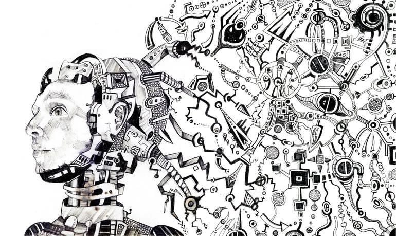

Programming a computer involves external software instructing the internal hardware. Similarly, for biological computers like the human brain, purpose or direction often comes from outside its own mechanism.

> The mind programs the brain 🧠 .

### The Relationship between Mind and Brain

While both are interconnected, some theorize the mind and brain as distinct entities. The brain, a sophisticated organ, operates like an intricate computer. It processes sensory inputs and motor commands based on conditioned reflexes. Yet, there’s an element of our cognition—our self-awareness—that transcends this mechanistic description. This consciousness, often ascribed to the mind, hints at something more profound.

Being aware of reading this very article or reflecting on one’s existence is the magic of consciousness in action. But is this consciousness purely a function of our physical brain, or is it an external, more ethereal component? The distinction is still a topic of much debate and research.

### The Power of the Mind

What if the mind, being separate yet deeply interconnected with the brain, holds the power to reprogram our neural pathways? Initiatives like the CIA’s MK Ultra program have delved into the potential of mind control, showcasing the immense influence of the mind. Furthermore, the field of cybernetics offers astonishing insights into how systems, including the human brain, can be controlled and transformed.

The mind’s capabilities are undeniable, and it’s often described as having a distinctive “energy.” This energy might be a metaphorical reference to its power and influence, or it could literally point to a measurable force, like neural activity. However, the exact nature and source of this energy remain elusive to current scientific understanding.

The mind and brain, two entities of vast complexity, continue to fascinate and baffle scholars and scientists alike. As we inch closer to understanding them, we must keep an open mind—embracing both the tangible and the intangible aspects of our existence.

<small> Reference image by saatchiart</small>
