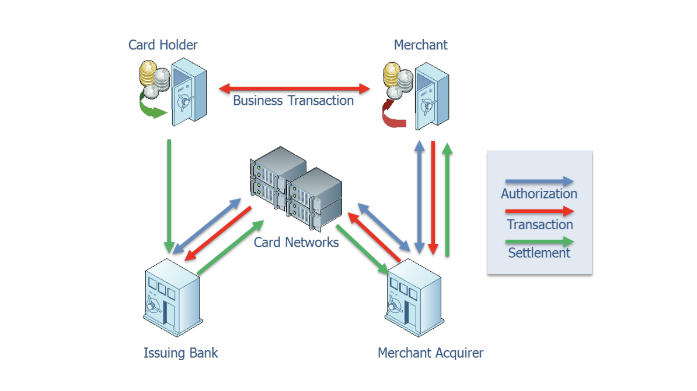

Today, banking is possible anywhere you are. As long as you have a mobile phone with you, it's all the bank you need. You can buy that item you want, pay your bills and transfer money to a friend. All while enjoying a coffee in your favourite cafe. Financial bodies continually simplify the way we make transactions.

But payments haven't always been this easy: At the beginning of the 20th-century payments for rents, salary, and taxes became routine for many people, yet paying in cash became increasingly inconvenient. Manufacturing cash was expensive, carrying it unhandy.

In the pre-digital world, doing all your banking by mail or at post offices all over the country was as convenient as it could get. Then rapid growth forced even more innovation, as bankers considered going from manual to automated administration — it took quite some pioneering to get it to work.

Yet by the 1960s, state-of-the-art computers had successfully taken over the administration process. In this era, following the post-war reconstruction in the 50s, young people all over the world challenged societal conventions. The Swinging Sixties were filled with protests, revolution, music, love, and a desire to make things simpler, banking included.

Technical changes mirrored social changes. People no longer had to rely on bank cashiers to withdraw money. The first ATMs were installed in North London in the late 60s. Banks were also keen on innovating payments both in stores and other points of sale, as well as paying bills and wiring money. Electronic banking was introduced in simple balance checking via phone calls. Plastic money became both cutting edge and the norm as consumers could pay with their cards in more and more places.

The digital revolution continued with early mobile banking, followed by contactless payment cards in the UK making your money easier and more convenient to access. Right now our wallets are being digitized with payment information being carried on phones and devices instead. The speed and ease of managing money will continue to increase with banking becoming more accessible around the globe.

### Payment Systems

A payment system is a set of processes and technologies that transfer monetary value from one entity or person to another. Payments are typically made in exchange for the provision of goods, services or to satisfy a legal obligation. They can be made in a variety of currencies using several methods such as cash, cheques, electronic payments and cards. The essence of a payment system is that it uses cash-substitutes, such as cheques or electronic messages, to create the debits and credits that transfer value.

The value that is being transferred is typically stored in depository accounts at banks or other types of financial institutions. The banks, in turn, are connected to a set of payment systems that they use to process payments on behalf of their customers or depositors.

In the simplest case involving the traditional banking system, payments involve four participants:

- _The payer:_ Makes the payment and has its bank account debited for the value of the transaction.
- _The payer's financial institution:_ Processes the transaction on the payer's behalf.
- _The payee's financial institution:_ Processes the transaction on behalf of the payee and generally holds the value in an account.
- _The payee:_ Receives value of the payment by credit to its account.

In the simple case illustrated in the above figure, the two banks may choose to transfer payment instructions and funds directly with each other. It is also possible for the banks to use various intermediaries to help facilitate the transaction. The diagram refers to these intermediaries as "network"—the central banks in most cases.

Non-traditional payment systems such as Bitcoin bypass the banking system almost entirely by fulfilling the roles of a financial institution, currency and network themselves.

The operation of the model is often referred to as the payment process and it involves four basic steps:

- _Payment instructions_ are the information contained in a wire transfer or cheque. These instructions are from the payer and tell the paying bank to transfer value to the beneficiary through the network and receiving bank.
- _Payment generation_ is when the instructions are entered into the system—e.g. printed on a cheque or transmitted via ACH or wire.
- _Clearing_ is the process where the banks use the payment information to transfer money between themselves on behalf of the payer and the beneficiary (payee).
- _Settlement_ is the final step in the basic process and occurs when the beneficiary's (payee's) bank account is credited and the payer's bank account is debited. Final settlement occurs when the banks irrevocably pass value among themselves, a distinction that has important treasury implications.

The actual payment process will depend on the type of payment instrument that the payer and payee choose to use—or have chosen for them by their financial institutions.

### Payment Channels

Payments originators and their processors can use different channels to make a payment and each has different operating characteristics, rules and settlement mechanisms. All payment systems can be placed into one of the following five payment channels:

- _Paper-based_ systems such as cheques or drafts. Payments are initiated when one party writes an instruction on paper to pay another. These systems are one of the oldest forms of non-cash payment system. Cheques are a common paper-based channel and while in decline are still widely used.
- _RTGS (Real Time Gross Settlement)_ and other high-value payments; called wire transfers by most people. Wires came into being in the late 1800s with the invention of the telegraph but did not become widely used until the early 1900s.
- _Low-Value Batch Systems or Automated Clearing House (ACH)_ batch payments were introduced in the early 1970s and were designed to replace cheques with electronic payments. Unlike wires, which are processed individually, ACH payments are processed in batches and were originally intended for smaller payments than the RTGS, such as payroll and consumer transactions.
- _Cards_ are a payment channel that includes credit, debit and stored-value cards. They are a heavily used and fast-growing segment of the methods for making and receiving payments. The card channel also often provides the "rails" or settlement systems supporting some of the newer e-commerce payment systems such as mobile wallets.
- The explosion of _mobile applications, cryptocurrencies_ and other payment alternatives has created several payment methods that do not neatly fit in the preceding four channels. While the rules of settlement and value transfer are not suspended for this channel this paper recognizes them as distinct.

I'll expand on the Card type of payments, as it's commonplace in the emerging economies.

#### Card-Based Payments

Card-based systems, which include both debit and credit cards, are a fast-growing form of payment and becoming the predominant channel for retail consumer payments. Although a third-party vendor may issue credit or debit cards, bank-issued cards are the most widely used. A credit card is issued against a line of credit that the institution or merchant has extended, whereas a debit card is issued against a deposit account held by a business or consumer. Stored value cards, such as gift and payroll cards, are a special type of debit card that do not access a specific bank account but are prefunded at the time of issuance. Some stored-value cards can be "reloaded", where funds can be added to the available balance extending their usability.

The diagram above shows the participants in a typical card transaction. The cardholder presents a card for payment to a merchant. The merchant captures the transaction information and sends it to its merchant acquirer, typically a bank, for authorization. The merchant acquirer queries the issuing bank for authorization for the transaction via the appropriate card network which it then returns to the merchant. If the transaction is denied, the payment is cancelled. If the transaction is approved, the payment is completed. The merchant then sends the final transaction information to the merchant acquirer, either at the time of transaction or more typically in bulk at the end of the day. The merchant acquirer presents the transaction to the issuing bank, again using the appropriate network. Each card network settles the net amount of the day's card transactions between all of its member banks. The issuing bank charges the card holder's account and the acquirer credits the merchant's account net of any transaction fees.

#### Networks vs Schemes

- A _network_, at its simplest, is a directory of participants along with the information required to access their stores of value and settle transfers: names and addresses, account details, and so on. Primary networks, such as ACH and real-time gross settlement (RTGS), are integrated with bank systems and do not rely on any other settlement mechanisms to execute payments.
- A _scheme_ also has a directory of participants, but what differentiates it from a network is that it also enforces rules and standards. As well as connecting to bank networks to transfer funds, it ensures that participants abide by rules and standards on fraud liability, participant eligibility, data security, and other matters. Examples of payments schemes include Visa, Mastercard, China UnionPay, Zelle, and TransferWise.

***

You just completed the first part of the _Payment Systems, and the Emerging Economy_ blog post. <a href="/payment-systems-and-the-emerging-economy-pt-2" class="read-more">_(Read the concluding part here)_</a>

<small>
References:
<a href="https://www.researchgate.net/publication/257716174_Payment_Systems_in_Economy_-_Present_End_Future_Tendencies" target="_blank">
Researchgate's Payment Systems in Economy</a>;
<a href="https://www.treasuryalliance.com/assets/publications/payments/Fundamentals_of_Payment_Systems.pdf" target="_blank">
Treasuryalliance's fundamentals of Payment Systems</a>;
<a href="https://www.mckinsey.com/industries/financial-services" target="_blank">
Mckinsey's financial services insights</a>.
</small>
