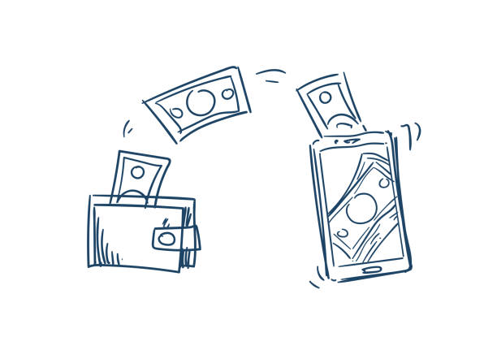
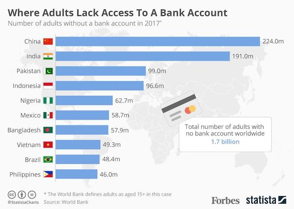
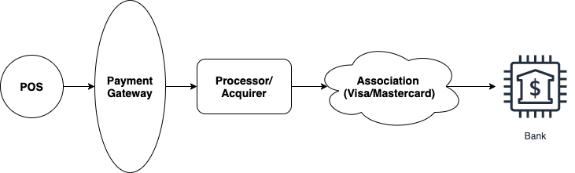

This is the concluding part of the _Payment Systems, and the Emerging Economy_ blog post.

### Building a payments system for emerging economies

According to the World Bank, financial inclusion is a key enabler in reducing poverty and boosting prosperity.

About 1.7 billion adults worldwide still don't have access to a bank account <a href="https://globalfindex.worldbank.org/sites/globalfindex/files/chapters/2017%20Findex%20full%20report_chapter2.pdf" target="_blank" class="read-more">_(Worldbank globalfindex)_</a>.

Financial inclusion means that individuals and businesses have access to useful and affordable financial products and services that meet their needs – transactions, payments, savings, credit and insurance – delivered in a responsible and sustainable way.

Apart from protecting your money from theft, a bank account connects people to the formal financial system and enables them to make day-to-day living less complicated as well as allowing them to build up their assets. Lack of access to financial products and services means limited access to credit. A majority of the world’s poor population work in the informal sector. They grow crops on a small scale and rear animals. Others are artisans who sell wares to the population while others are small-scale vendors who sell basic items such as food and vegetables. However, despite their ability to make further investments in their little enterprises and improve their lives, they lack access to credit which would have helped them achieve such a goal, <a href="https://www.cgap.org/research/publication/financial-inclusion-and-development-recent-impact-evidence" target="_blank" >as this research shows</a>.

#### Financial Inclusion Efforts in Nigeria

> According to research done by The Fletcher School and Mastercard Center for Inclusive Growth, of the $301 billion of funds flows from consumers to businesses in Nigeria, 98 percent is still based on cash.

Several players in the Nigeria Fintech space are attempting to help close the gap of financial inclusion, and tapping into this cash-rich system, by providing basic banking solution, while penetrating into rural areas with few or no banking presence. This solution comes in the form of _Agency Banking_.

<b>Agency banking</b> is a type of branchless banking that allows the delivery of financial services outside conventional bank branches, often using agents and relying on information and communications technologies to transmit transaction details – typically card-reading point-of-sale (POS) terminals or mobile phones. It has the potential to radically reduce the cost of delivery and increase convenience for customers.

The Nigerian payments system witnessed remarkable achievement with the introduction of a number of initiatives under the <a href="https://www.cbn.gov.ng/icps2013/papers/NIGERIA_PAYMENTS_SYSTEM_VISION_2020%5Bv2%5D.pdf" target="_blank" >Payments System Vision 2020</a>, the implementation of Bank Verification Number (BVN) scheme to address issues associated with the absence of unique identifier of bank customers across the country to put an end to identity theft which has been a worrisome phenomenon. There is no doubt that considerable progress has been made with the payments system as evidenced by the time it takes for third party instruments to be cleared for value to be given.

The CBN _Financial Policy and Regulation Department_ develops and implements policies and regulations aimed at ensuring financial stability. It also licenses and grants approvals for banks and other financial institutions to commence operations.

<a href="https://www.cbn.gov.ng/Out/2013/CCD/GUIDELINES%20FOR%20THE%20REGULATION%20OF%20AGENT%20BANKING%20AND%20AGENT%20BANKING%20RELATIONSHIPS%20IN%20NIGERIA.pdf" target="_blank" >Detailed guidelines for Agency Banking in Nigeria</a> was issued by the Central Bank on February 2013 to regulate the relationship aimed at the provision of minimum standards for the effective operation of Agent Banking relationship in the country. In the Nigerian situation, the relationship could be either bank or non-bank led particularly Mobile money operators.

The scope of permissible activities as detailed in the guidelines includes essentially the performance of basic banking operations. The major benefits expected to be achieved under this scheme is to promote greater financial inclusion by reaching the unbanked and by making services available for hours beyond what should be expected with banks as they keep to their regular banking hours. Though the license is renewable biennially with monitoring scheduled annually, no comprehensive report of the Agent banking experience in the country has so far been advertised. It is on record that some of the banks in the country have taken advantage of the scheme to contribute their quota to more financial inclusion and to that extent grow their customer base.

#### POS Business

A banking agents who run a _POS business_, as it's predominantly called, usually owns and operates a retail outlet, or a kioks where they conduct financial transactions that allow customers to deposit, withdraw, transfer funds, pay bills, recharge airtime, do balance inquiry, and other related services.

The business thrives in rural, and semi-urban centres with the unbanked & underbanked populace. Banks or super-agents equip agents with point-of-sale (POS) card reader, mobile phone, barcode scanner, personal identification number (PIN) pads, personal computer, etc, to be able to transact.

Here's an exhaustive list of services that can be rendered:

- Cash-in (deposit money)
- Cash-out (withdraw money)
- Balance inquiry
- Airtime purchase
- Bill payments
- P2P transfer
- Generate mini statements
- Collection of document
- Micro-loans

Agency banking offers a seamless solution for banks, retailers, and customers. It allows banks to expand their services in the remote areas where they previously wouldn’t have been able to reach.

Agency banking is transforming banking all around the world. It will be interesting to see how much impact will it have on the banking industry soon.

#### A deeper look into the POS payments space

To make sense of the POS payments space, one needs to understand the roles of the _Payment Gateway_ and _Payment Processor_.

- <b>Payment Gateway</b> is an application service provider that authorizes payments for businesses, online retailers or
  traditional brick and mortar. In simple terms, a payment gateway can be thought of as an interface between
  merchants and payment processors. The payment gateway accepts payment request from merchants and forwards this to the
  payment processor for further processing.

- <b>Payment Processor</b> is an entity that has a direct interface to card associations or networks such as VISA and MasterCard.
  The payment processor receives payment requests from merchants or payment gateways and sends it to the card association
  or networks, which, in turn, route the transaction to the card-issuing bank for authorization.

Payment processors are also referred to as acquirers. The payment processor as a whole is a complete payment processing
engine that processes real-time transactions and end of day settlement requests and are also responsible for handling
chargebacks from the Issuing bank.

***

Studying the Nigeria payments space, one can see an emerging convergence between the POS and payment gateway industry.
Agent facilitators and super-agents are leaning towards implementing their payment gateway to get a cut of all the transactions that are
processed via the POS.

Payment gateways usually offer easy integration to merchant applications, although it comes as an additional cost to the
merchant. The merchant can save this additional cost by integrating directly to the payment processor. While this is
true, several other factors should be considered when choosing between the payment gateway and payment processor:

- _Total Transaction Volume:_ The payment processors have different transaction fee rates that depend on the volume of transactions.
  Most of the payment processors offer lower rates for a high volume of transactions. It would be more feasible for small
  businesses with a small volume of transactions to go through a payment gateway.

- _Integration Cost & Time:_ The development cost and time for integrating with a payment processor are higher as compared
  to payment gateway integration. The Payment processor requires integration to their ISO 8583 platform and undergoing their
  certification process.

- _Compliance:_ Integration to payment processor requires a PCI certified infrastructure and adherence to all compliances
  set by the card association network (VISA and MasterCard). The payment gateway on the other hand deals with all the intricacies
  related to ISO 8583 integration and the payment processor certification process. The time and cost associated with payment gateway
  integration are much lower as they offer a simple API layer for accepting and processing payment requests from merchants.

- _Settlement:_ The payment gateway handles the settlement on behalf of merchant while the payment processor expects the
  merchant to send the end-of-day settlement request and handle the settlement file to be imported back into the system.

Throughout history, as payments evolved from barter to coins to notes to cards to digital wallets, the underlying revenue
model for each method (whether merchant, interchange or flat fees) has remained much the same. However, as digital payments methods,
omnichannel, and instant payments converge to transform the payments industry, revenue models are likely to change, too.
New networks and schemes will aggregate volumes and build ecosystems that generate network effects, enabling them to maintain
premium pricing for customers while using low-cost bank rails to transfer funds.

<small> References:
<a href="https://www.mckinsey.com/industries/financial-services" target="_blank">
Mckinsey's financial services insights</a>;
<a href="https://www.chetu.com/blogs/finance-2/" target="_blank">
Chetu software solutions blog</a>.
</small>
