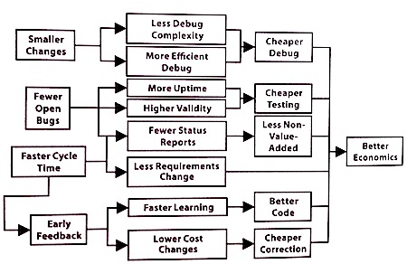

_The Principles of Product Development Flow_ by Donald Reinertsen is a book on Lean Product Development that systematically applies various economic concepts, lean manufacturing, statistics, queuing theory, etc, to the product development process. Reinertsen organizes these theories into 8 main themes and outlines 175 principles to provide guidance for product development. Some of these principles include concepts such as reducing batch sizes, limiting work in progress, and enabling teams to make decisions.

The author places great emphasis on the importance of managing queues and argues that bottlenecks and queues often hinder the flow of work in the product development process. The book provides a thorough and in-depth method for managing product development processes, making it a valuable resource for anyone seeking to enhance the speed and efficiency of their product development efforts. 

In the rest of this write-up, I'll give a brief overview of some important concepts covered in the book, and then take a more detailed look at managing queues, which is a crucial aspect of product development processes.

### The Principles of Product Development Flow

The concept of product development flow is built around the idea that a seamless and steady flow of work through the development process can enhance efficiency and minimize waste. The methodology seeks to remove bottlenecks, decrease cycle time, and accelerate product delivery.

#### The Economic View

The _Economic View_ described in the book is about making financially viable decisions throughout a product development process. This view recognizes that all product development activities have a cost, and the goal is to maximize the economic value created by the product while minimizing the cost of development.

Reinertsen argues that many product development organizations focus too much on reducing development costs, rather than understanding the economic impact of delays in the product development process. By taking an economic perspective, product development teams can make more informed decisions about the allocation of resources and trade-offs between speed, cost, and quality in order to maximize the economic value of the product.

Reinertsen points out that product developers often use proxy measurements that offer little or no economic connection with the marketplace.

> As Eric Ries puts it in his review <a href="http://www.startuplessonslearned.com/2009/07/principles-of-product-development-flow.html" target="_blank" class="read-more">_(here)_</a>: The goal [of the book] is to help us recognize that every artifact of our product development process is really just a proxy variable. Everything: schedules, efficiency, throughput, even quality. In order to trade them off against each other, we have to convert their impact into economic terms. They are all proxies for our real goal, maximizing an economic variable like profit or revenue. Therefore, in order to maximize the true productivity (aka profitability) of our development efforts, we need to understand the relationships between these proxy variables.

Two important points from this chapter:

- If you only measure one thing, measure the cost of delay
- Measure the work, never the worker

Most economic factors in product developement can be traced back to managing delay. Once we quantify the cost of delay, we become aware of the cost of queues.

Although, this does not mean that we should spend extensive effort and time on computing the economic value of everything in the product development process. Reinertsen argues that just getting close delivers almost all of the value of measurement with a fraction of the effort.

The graph above shows a classic example of batch size optimization which trades off a hyperbolic function against a linear function. Knowing that important optimizations take this form is surprisingly useful because the U-curves have two important properties. First, optimization never occurs at extreme values. If optimization occurred at extreme values, then quantification would be unnecessary. We would only need to know the direction that maximizes performance. In contrast, U-curve optimizations virtually always require quantification, because we must balance two or more competing factors.

#### Exploiting Variability

Variability refers to the differences and uncertainties that are inherent in any product development process. These can include differences in customer needs, changes in technology, and uncertainties about the availability of resources.

According to Reinertsen, product development teams can benefit from exploiting variability by using it to their advantage. Instead of trying to eliminate variability, teams can manage it in a way that allows them to create better products more efficiently.

The concept involves several key principles:

- Product development teams should be aware of the variability in their process and should actively seek to understand and manage it.
- Variability can be used to improve product performance, reduce costs, and increase efficiency.
- Teams should use a variety of tools and techniques to exploit variability, including statistical analysis, simulations, and scenario planning.
Effective exploitation of variability requires collaboration and communication among team members.
For example, one way to exploit variability is through the use of statistical process control (SPC) techniques. SPC involves monitoring the development process for variations and using that data to make adjustments to the process in real-time. By doing so, teams can identify and correct issues before they become major problems, reducing waste and improving quality.

The figure below shows how to measure variability with a payoff function. Reinertsen advise we use statistics-based steps to reduce variation, such as smaller tasks and time limits; mininimizing the impact of variability by economic prioritisation, faster iterations, and early high-risk actions.

While building a product, you get to a stage where adding more features becomes more expensive than the advantages they provide. By utilizing economic principles to measure the value of these features, we can determine their benefits and make a well-informed decision about whether it's financially feasible to include more features.

#### Enable Smaller Batches

This principle is based on the idea that smaller batches can help reduce the cost of delay, increase flow efficiency, and ultimately improve the overall quality of the product development process.

Enabling smaller batches means breaking down the development process into smaller units of work, which can be completed in a shorter time frame. Instead of waiting to complete an entire project before releasing it, teams can release smaller batches of work more frequently, allowing for quicker feedback and the ability to make adjustments based on that feedback.

Big iterations require big queues. Reducing batches can have many benefits in a software development environment. Here is an example pulled from the book for the testing portion of software development.

The batch size chapter reiterates the concepts of Agile or Lean principles: colocation, short iterations, low hanging fruit, and modular design are all discussed. While none of these ideas is new, it is valuable to read about them in the context of maximizing economic value.

#### Applying WIP Constraints

The chapter discusses how costs can be minimized by controlling work-in-progress. Detailed planning and control of tasks are costly. It is more effective to control the work in process between major functions.

This principle is inspired by lean manufacturing concepts such as the Toyota Production System <a href="https://www.abayomipopoola.com/toyota-case-of-lean-product-development/" target="_blank" class="read-more">_(read it)_</a> and the Theory of Constraints, which emphasize the importance of optimizing the flow of work to achieve maximum efficiency and quality.

By managing the flow of products, teams can identify bottlenecks and areas of inefficiency, and work to minimize the work in progress (WIP) at each stage of the process. This can be achieved through various scheduling, prioritization, resource allocation, and recovery strategies.

For example, teams can use Kanban boards to visualize the flow of work and limit the amount of WIP at each stage, ensuring that work is completed in a timely manner and that resources are not overburdened. Prioritization strategies can also be used to ensure that high-priority tasks are completed first, minimizing delays and improving the overall flow of work.

Resource allocation is another important strategy for managing the flow of products. By allocating resources effectively, teams can ensure that each stage of the process has the necessary resources to complete work efficiently and on time. This may involve adjusting staffing levels, investing in new tools or technologies, or outsourcing certain tasks to external vendors.

By limiting the amount of work-in-progress, organizations can improve flow and ensure that work moves through the system quickly and efficiently. This helps to reduce the time it takes for work to move through the system and improve the overall efficiency of the development process.

#### Controlling Flow Under Uncertainty

Reinertsen discusses how to manage the flow of work through the product development process in the face of uncertainty. The chapter describes how traditional methods of managing product development, such as the use of Gantt charts and project plans, are inadequate when it comes to managing uncertainty. Instead, Reinertsen suggests that a more effective approach involves using feedback loops to monitor the flow of work and make adjustments in real-time.

The chapter also covers topics such as how to manage bottlenecks, how to deal with variability and how to create slack in the system to enable better flow. The idea is to create a product development process that is flexible and can adapt to changing conditions, rather than one that is rigid and inflexible.

> The flow of activities through product development can be managed. Use forecasts and share information between adjacent stages. Use cadence to set routine start/stop times. Sequence tasks and change priorities based upon risk and incremental economic value added.

#### Accelerate Feedback

This chapter focuses on the importance of gathering and utilizing feedback throughout the product development process. Reinertsen argues that traditional methods of product development, which involve lengthy planning cycles and a focus on execution, often lead to a lack of feedback and can result in wasted effort and resources. Reinertsen suggests that a better approach involves accelerating feedback loops, both within the development team and with customers and stakeholders.

By accelerating feedback loops, product development teams can quickly identify and address problems, make better decisions and reduce the risk of delays or failures. The chapter discusses various techniques for accelerating feedback, such as using prototyping, simulation, and experimentation.

The chapter also covers topics such as the importance of creating a culture that values feedback and the role of metrics and measurement in facilitating feedback loops. The goal is to create a product development process that is agile, flexible, and responsive to feedback, resulting in better products and improved outcomes.

> Develop rapid feedback systems. Employ early warning systems and value at risk triggers to escalate reviews. Align activities through training, incentives, and templates. Adjust decisively when required. Use frequent communication to build teams and short queues to build urgency. Employ flow metrics.

***

You just completed the first part of the _The Principles of Product Development Flow_ blog post. <a href="/principles-of-product-development-flow-pt-2" class="read-more">_(Read the concluding part here)_</a></a>

<small>References: <a href="https://www.amazon.com/gp/product/1935401009" target="_blank">The Principles of Product Development Flow by Donald Reinertsen</a>
</small>
