This is the concluding part of the _The Principles of Product Development Flow_ blog post.

### Managing Product Development Queues

Queues are everywhere in product development. The waiting lists or backlog of tasks or items that need to be completed or processed, list of bugs to be fixed, features to be added, or requests to be addressed.

Queues are an integral part of product development because they help teams prioritize work and manage their workflow. When new tasks or items are added to the queue, they are typically assigned a priority based on their importance and urgency, and this helps team members decide what to work on next.

One common use of queues in product development is in Agile software development methodologies. In Agile, work is typically organized into short iterations called sprints. During each sprint, the team works on a prioritized backlog of tasks, which is essentially a queue of work items. The backlog is constantly evolving, with new items being added and others being completed, and the team adjusts their priorities accordingly.

Queues are an essential tool for managing the complex and ever-changing workflow of product development. They help teams stay organized, focused, and productive, which ultimately leads to better products and happier customers.

#### Queueing theory

Queueing theory is a mathematical approach to the study of waiting lines, and it provides a framework for understanding the behavior of systems that involve waiting in line, such as banks, grocery stores, and call centers.

The queue refers to the line of customers waiting to be served. The length of the queue and the waiting time of customers in the queue can be influenced by various factors, such as the arrival rate, the service rate, and the number of servers available.

Queueing theory provides a way to analyze the performance of a queue systems and to identify ways to optimize them, such as by increasing the number of servers, improving the service rate, or reducing the arrival rate. The principles of queueing theory can be applied to a wide range of systems and are used in various fields, such as operations research, computer science, and engineering.

> The arrival process in a queueing system describes how customers or requests enter the queue. Various models can represent it, including the Poisson process, where customer arrival is a random event that conforms to a particular probability distribution.

#### Queues and Product Development

Product developers have an idea that if people work all the time, product features get delivered faster. A common misconception is that high utilization leads to faster delivery of product features. However, this approach can often result in overloading the system, leading to bottlenecks and delays.

In a product development process, work can be thought of as a series of tasks that move through the system, similar to a queue. However, unlike a physical queue, the work queue in product development is often invisible and harder to measure. This makes it more difficult to manage and optimize the flow of work. When the work queue grows without proper management, it can result in long wait times, reduced throughput, and lower overall efficiency. This is because, in a product development process, work is often dependent on other tasks and resources, leading to complex interdependencies and bottlenecks.

To avoid these issues, product developers need to focus on managing the work queue and optimizing the flow of work. This can be achieved by using flow management techniques such as limiting work in progress, prioritizing work based on customer value, and implementing pull systems to ensure that work is only started when it is needed. By managing the queue, product developers can ensure that work moves smoothly through the system, leading to faster delivery of product features and improved overall efficiency.

> Invisible and unmanaged queues are the root cause of poor economic performance in product development.

Queue management is a critical aspect of product development and can have a significant impact on the overall efficiency and effectiveness of the process. Borrowed metrics from lean manufacturing: lead time, cycle time, wait time, and throughput, are all interrelated and are used to measure the flow of work through the system.

By managing queues and reducing wait times, organizations can improve the flow of work and ultimately reduce the overall lead time and cycle time. This, in turn, leads to faster delivery of products and services, higher customer satisfaction, and a more efficient use of resources. Queue management is also crucial in identifying bottlenecks in the process and addressing them, which can help organizations improve their overall performance and achieve their goals.

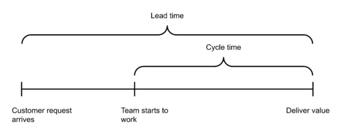

Cycle time is a crucial metric in product development as it provides valuable information on the time taken by the team to complete tasks, allowing for the identification of bottlenecks and areas for improvement. When used along with other metrics like defect density, unit test code coverage, and defect injection rate, cycle time provides a comprehensive view of the product development process and helps teams make data-driven decisions to optimize their workflows. Additionally, tracking cycle time can also help organizations understand their overall velocity and predict future delivery timelines with greater accuracy.

#### Capacity Utilisation

Underestimating the cost of queues in product development leads to process overloading. Queues affect capacity utilization: As queue size increases, we tend to apply more of our capacity to alleviate the situation. This increased capacity utilization reduces our flexibility.

Queues in a given process occur right before a step with limited capacity and/or high utilization (Product management, Engineering, QA). Capacity utilization is the single most important factor in the occurrence of queues. This is somewhat natural because when a process is run at 100% utilization, any new work would automatically sit on the “waiting” queue until someone has the free capacity to take it.

The interesting part is that capacity utilization affects the size of the queue exponentially: going from 80% utilization to 90% utilization would double the queue size; going from 90% to 95% will double it once again. Since the queue size also affects the cycle time of each new job, you have to be careful what percent utilization you operate your processes on. If cycle time is important — choose lower utilization, which would guarantee a quick turnaround time for important new tasks.

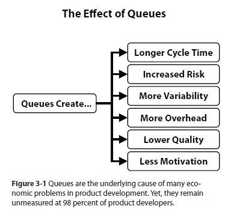

Also, it is important to note that queues are not always bad, and whether you should allow a queue of a given size to occur is an economical question (more on that in the next section). If an extra developer costs you _N_, but the potential delay of the project costs you _100 x N_, then it might be wise that you just get the developer and zero down the development queue. However, if you need to spend a lot of money to shorten the test cycle by one week and the benefit would be a mere pat on the back, then that shouldn’t count.

If you have a process or a staff that affects the overall throughput of the system (bottleneck), you don’t want any idle time for them. To make sure they always have something to work on, you deliberately build a queue right before them. This queue takes away the variation of arriving new tasks and ensures maximum throughput for your process.

Product management happens to have a big queue of non-refined ideas collected by the team or other teams. A lot of ideas could propel the company to the next level, as long as product management has the capacity to refine them into real business cases and work with the engineering teams to realize them. Failing to do so results in a lot of missed opportunities or sometimes direct losses, when customers churn because their feedback was not heard.

This is the right place to say that implementing a FIFO (first in first out) scheduling algorithm for product management (like the one lean people use in manufacturing) might be a really bad mistake. One of the methods to minimize the economic losses caused by queues is to sequence the jobs in the most economically feasible order. If you have a very critical job, that might lead to a lot of extra costs if delayed, you may want to schedule it before many others, that have no such risk associated with them. If you have two such jobs, you may want to start with the shorter one.

Queues have a profound affect the product development processes. They cause valuable work products to sit idle, waiting to access busy resources. Queuing theory is interested in the various qualities of a queue. Its importance within software engineering can not be understated. A team that does not manage its queues properly is running the risk of slow delivery, long cycle times and large batch sizes.

#### Cumulative Flow Diagram

The Cumulative Flow Diagram (CFD) is a visual tool that helps manage the product development queue. It is a graph that shows the flow of work items through different stages of a process over time. The CFD is especially useful in managing product development queues that involve multiple stages and parallel work streams.

The CFD displays the number of work items in each stage of the development process, from the beginning of the project to the present time. The vertical axis of the diagram represents the number of work items, while the horizontal axis represents time. The CFD typically includes separate lines or areas for each stage of the process, such as backlog, design, development, testing, and deployment.

One of the benefits of the CFD is that it can help identify bottlenecks in the product development process. Bottlenecks are stages of the process where work items tend to accumulate and get stuck. By identifying these bottlenecks, product managers can focus on improving the efficiency of these stages, which can improve the overall speed and quality of the product development process.

The CFD can also help product managers understand the overall flow of work items through the product development queue. By analyzing the trends in the CFD over time, product managers can identify patterns and make data-driven decisions about the prioritization of work items and the allocation of resources.

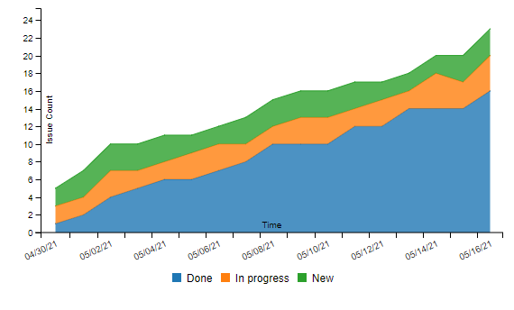

The chart above is an example of a CFD, where the x-axis represent the time frame that the chart is visualising the data for. The y-axis represent the cummulative number of work units that are in the work flow at the time of measurement.

The cumulative flow diagram is also a crucial Kanban analytics tool and provides an overview of the current state of your project.

Kanban is a popular approach to managing workflow that involves visualizing work on a board that is divided into columns. Each column represents a different stage of the workflow, and tasks move from left to right as they progress through the various stages. In a typical Kanban board, there are three columns: “To Do,” “Work in Progress” (WIP), and “Done”.

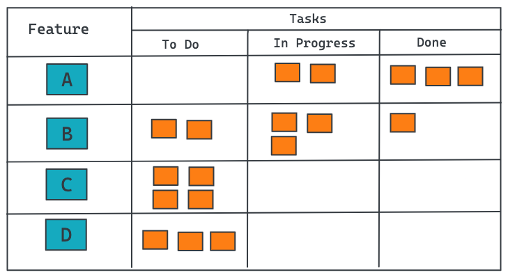

A cumulative flow diagram can be used to track the performance of a Kanban board and identify areas for improvement. The CFD displays the cumulative amount of work in each stage of the workflow over time. The shape and slope of the lines on the diagram can reveal valuable insights into the efficiency of the workflow.

By using a CFD to track the performance of a Kanban board, we can monitor several important metrics:

- **Cycle time**: This is the time it takes for a single task to move through the entire workflow, from “To Do” to “Done.” By analyzing the slope of the line for the “Done” column, we can estimate the average cycle time for each task.

- **Work in progress (WIP)**: This is the number of tasks that are currently in progress within the workflow, represented by the height of the line for the “Work in Progress” column. By looking at the overall shape of the CFD, we can see how WIP levels fluctuate over time and identify periods of high or low utilization.

- **Throughput**: This is the number of tasks that are completed within a given period of time, represented by the steepness of the overall slope of the CFD. By measuring the throughput of the workflow, we can estimate the overall efficiency and productivity of the team.

By collecting and analyzing these metrics over time, we can identify trends and patterns in workflow performance and make informed decisions about how to improve processes and optimize performance.

#### How To Read a Cumulative Flow Diagram

The aim of a cumulative flow diagram is to show you the stability of your process over time. It tracks and accumulates each task that is ever entered or progressed to any stage of your workflow.

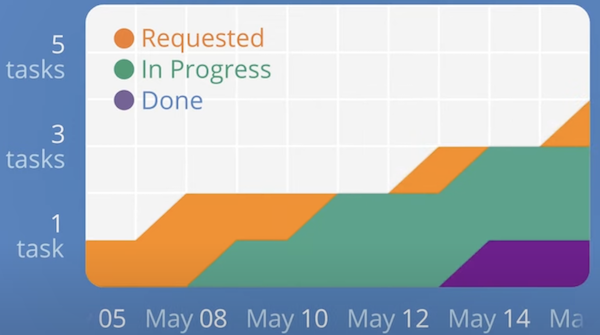
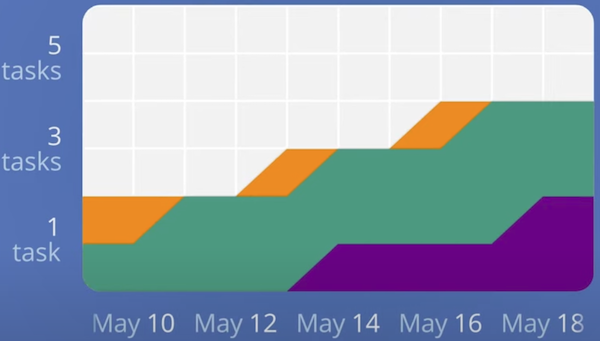

Whenever you complete a task the number in your process is done stage will rise permanently. Each stage has an arrival and a departure line. The vertical distance between them visualizes the number of tasks that were in this stage of your workflow at the time.

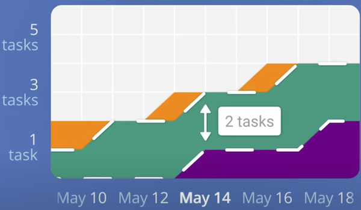

The horizontal distance between your first and last stage shows the approximate average cycle time for your tasks, meaning the time it took you to progress a task from being requested to done.

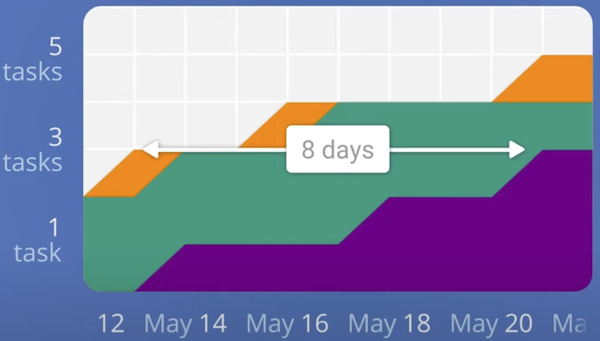

Let’s take a look at the workflow of an example software development team whose process involves five stages:  

Requested to start → Design → Development → Review → Done.

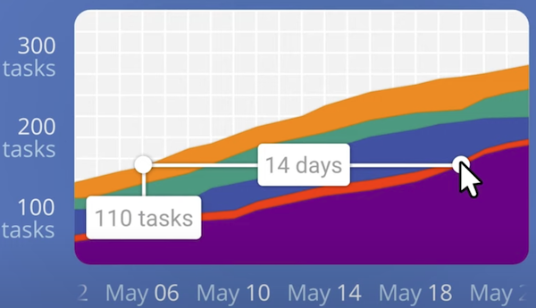

A quick look at the chart tells you more about their approximate average cycle time of two weeks along with a number of asks completed during that period. In order to determine whether their process is stable we need to monitor how the chart progresses in time. If the distance between the arrival and departure lines grows in parallel then most likely we’ve got nothing to worry about.

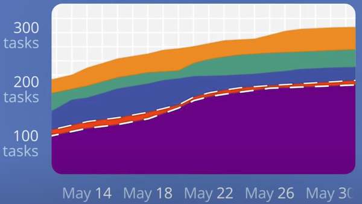

However if it starts to expand rapidly then tests are arriving faster than they can be processed and we need to take action.

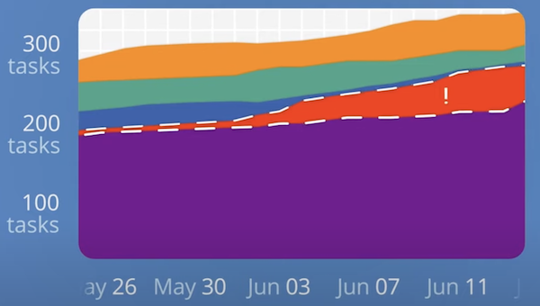

A properly built cumulative flow diagram always flows upward or sideways. If you ever see a line going down then the chart is incorrect since tasks should never disappear.

When the “In Progress” bar appears thinner, the team is working on smaller batches of tasks, which means they have less “Work in progress” (WIP). By working on fewer tasks at the same time, the team can concentrate better and create more value through the system. In the second diagram, if you imagine the same vertical and horizontal lines, you’ll see that having a smaller queue size has resulted in less delay.

#### How do we lower “Work In Progress”?

Pair programming and code reviews are methods that enable engineers to manage their work in progress (WIP) more effectively. By collaborating to tackle complex tasks, there are several additional benefits that arise.

Firstly, the quality of the code generally improves due to more thorough scrutiny and debate by multiple individuals. Secondly, silos are prevented from forming as individuals share their knowledge and understanding of their contribution with others. Thirdly, coaching becomes easier as engineers can pair up with those who have complementary skills, resulting in a more well-rounded team.

This approach builds resilience into the software engineering system without requiring restrictive WIP constraints such as limits on the number of tasks in progress.

By managing our WIP and being mindful of our queues, we remove constraints on flow. By removing constraints on flow, we unlock the team’s ability to pivot quickly without suspending good engineering practice. This property is and always will be, at the very heart of an agile culture and a necessary ingredient in the success of an organisation’s software engineering effort.

### Conclusion

The principles of product development flow are designed to optimize flow and improve the efficiency of the product development process. By understanding concepts like Little’s Law, queueing theory, flow management, work-in-progress limits, pull systems and flow metrics, organizations can take steps to eliminate bottlenecks in their development process and improve the flow of their development process. This leads to faster time to market, better quality products, and increased customer satisfaction.

I strongly recommend reading “The Principles of Product Development Flow” by Donald Reinertsen as it is an excellent book.

<small>References: <a href="https://www.amazon.com/gp/product/1935401009" target="_blank">The Principles of Product Development Flow by Donald Reinertsen</a>; <a href="https://kanbanize.com/kanban-resources/kanban-analytics/cumulative-flow-diagram" target="_blank">Cumulative Flow Diagram</a>; <a href="https://support.atlassian.com/jira-software-cloud/docs/view-and-understand-the-cumulative-flow-diagram/" target="_blank">View and understand the cumulative flow diagram</a>

</small>
