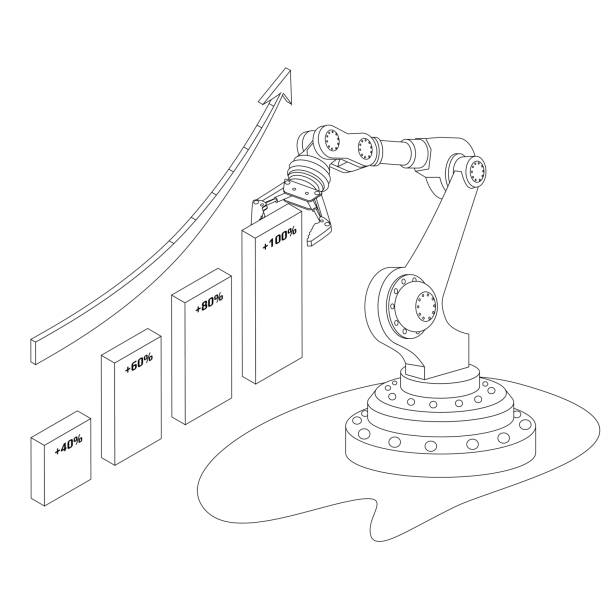

The Higgs field gives mass to fundamental particles—the electrons, quarks and other building blocks that cannot be broken into smaller parts. In order to isolate the Higgs boson—the fundamental particle associated with the Higgs field, scientist utilises the Large Hadron Collider (LHC) that creates 600,000,000 collisions among 3,000,000,000,000,000 protons every second. In the same time, over 50,000,000,000,000 byte of data are being analysed to prove the particle's existence.

With such massive and fast-growing data, Big data made it possible to analyse the plethora of particles. This data is analysed by algorithms that are programmed to detect the energy signatures left behind by the appearance and disappearance of the elusive particles CERN are looking for. The algorithms compare the results with theoretical data on how the particle is believed to act.

In 2013, scientists at CERN announced that they had found the Higgs boson particle—a ground-breaking discovery. Later that year, Nobel prize in physics was awarded jointly to François Englert and Peter Higgs “for the theoretical discovery of a mechanism that contributes to our understanding of the origin of mass of subatomic particles, and which was confirmed through the discovery of the predicted fundamental particle, by the ATLAS and CMS experiments at CERN's Large Hadron Collider”.

### DATA

Before computer became ubiquitous, data used to be recoreded on paper: sample survey and questionnaire, population census, student grades. They are usually time-consuming and not effective. Data collections are mostly structured and follows certain format for statistical analysis. The advent of computers help ease the labourious task of data collection and analysis, especially with spreedsheet application softwares like Microsoft Excel, Lotus 123, etc., that allows for organization, analysis and storage of data in tabular form.

The launch of World Wide Web (WWW) in 1989, by Sir Tim Berners-Lee, made it extremely easy and seamless to collect, store and analyse data on the computer. As the Web made data easily accessible, more people started contribution to the existing data. This resort to a very large volume of data with different formats: leading to structured, unstructures or semi-structured kinds of data.

We can classify structured data as the kind of data that are filled into a web form fields, as this data can be easily stored in a database, spreadsheet or any other table-style system with rows and columns—each row being the collection record, and each column a defined field (e.g. name, address, date of birth) of what is being collected in the intersecting row.

Unstructure data on the other hand, can't be easily categorised, e.g. tweets, photos, videos, clickstreams and other data from unstructured sources. Although taking a closer look into some of the unstructured data, we can re-classify some of them as semi-structured data: Email is a good example of a semi-structured data, as they contain structure metadata—like email heading, as well as the unstructure text and maybe photos or other attached documents. Metadata, data that describes and gives information about other data, can add some kind of structure to unstructured data: Like adding word tags to photos for ease of identification, or hashtags on social networking platforms for topic classifications. Unstructured data can't be stored in a table-style (relational databases), or on spreadsheet, making it hard to extract useful information from them even as there're lots of these data around us; for this, special tools have been built to help sort them out.

### Big Data Basics

The term "big data" refers not only to large data sets, but also to the techniques, and tools used to analyze it. Data can be collected through any data-generating process such as social media, public utility infrastructure, search engines, etc.. And as we've discussed earlier, Big data may be either structured, semi-structured, or unstructured.

Typically big data is analyzed and collected at specific intervals, but real-time big data analytics collect and analyze data constantly. The purpose of this continuous processing loop is to offer instant insights to users.

Today, with the average large business storing more than 200 terabyte, companies have more than enough data to tell them who is buying their products, as well as how, when and where the buying takes place. Customers expects companies to know how they feel about their product, and how they can be serve better. Customers drop cues all over the Web, and companies can get hold of this data and make sense of it. So the data is there, they're not just in the rows, columns, reports and purchase histories we're used to. They're mostly the unstructured types of data, and today, there are technology and tools to make sense of this data (e.g. IBM Smarter Analytics, etc.).

When we have enormous amount of information that can be made to interoperate with itself, we can come up with answers that will solve societal problems.

### Big Data Scandals

There have been issues of data-breaches with Big data. The biggest scandal yet, the Cambridge Analytica, a London-based political consulting firm that collects consumer data for use in election campaigns around the world.

The data of up to 87 million users, mostly in the U.S., was obtained by an analytics firm that, among its other work, helped elect President Donald Trump. In response to that revelation, lawmakers and regulators in the U.S. and U.K. increased their scrutiny of the social media giant, and at least some Facebook users canceled their accounts. The uproar has only added to the pressure on Facebook and Chief Executive Mark Zuckerberg over how the company was used during the 2016 presidential campaign to spread Russian propaganda and phony headlines <a href="http://bit.ly/2S4AFEs" target="_blank" class="read-more">_(Read more)_</a>.
