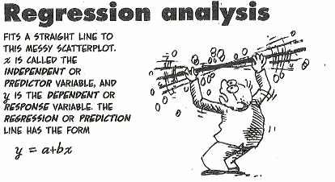

Regression analysis is a ubiquitous tool of scientific/statistical research, but what is it and how can it be explained simply? It's safe to define it as a method of measuring the link between two or more phenomena--establishing correlations.

### Correlation

Correlation is a statistical term that indicates whether two variables, x and y, move together--meaning they change together at a constant rate. It tends to be cold when it snows--positive correlation; rain and sunshine, on the other hand,
are negatively correlated.

So what happens when we’ve got more variables, say a couple of hundred variables? You guessed it--we employ ***Regression Analysis*** to help sort out huge piles of data.

This is made possible by artificially holding constant every variable except the two we wish to focus on, then showing how the two co-vary. For example, imagine an arbitrary set of data that measured students' academic performance of public schools in Surulere LGA, and gathered information about each child: his gender, family structure, socioeconomic status, the level of his parents' education, etc.

With respect to this data, it might help to think of regression analysis as performing the following tasks: converting each of those Surulere LGA schoolchildren into a sort of a circuit board with an identical number of switches. Each switch represents a single category of the child's data: his primary one math score, his primary four math score, his primary one reading score in english language, his mother's education level, his father's income, the relative affluence of his neighborhood, and so on.

Now a researcher is able to tease some insights from this very complicated set of data. He can line up all the children who share many characteristics--all the circuit board that has their switches flipped in the same direction--and then pinpoint a single
characteristic they don't share. This is how the effect of that switch--and, eventually, of every switch--becomes manifested.

### Asking data questions

Let's say we want to get some insights about parenting and education: Does having a lot of books in your home
(assuming it's part of the data collected) lead your child to do well in school? Regression analysis can't quite answer that question, but it can answer a subtly different one: does a child with a lot of books in his home tend to do better than a child with no books? The difference between the first and second is the difference between causality (question 1) and correlation (question 2).

A regression analysis can demonstrate correlation, but it doesn't prove cause. It helps establish the existence of connections that call for a closer investigation of careful studies and critical thinking.

<small>References: Freakonomics by Steven D. Levitt and Stephen J. Dubner; image, fiverr.com.</small>

