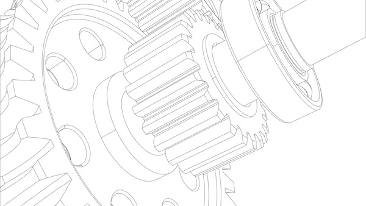
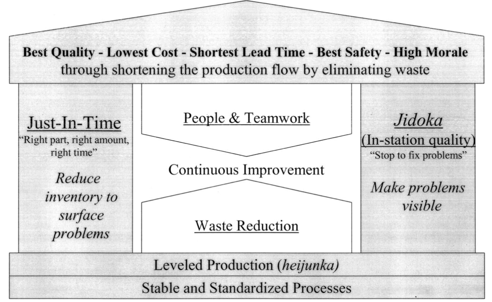

Toyota knows how to make cars so well that it became the first company to produce more than 10 million units a year. Its success is rooted in a special system and began what is now known as 'Lean Manufacturing', an ethos emulated by companies around the world to make products faster, cheaper and better.

Following the Second World War, Japan was left in a precarious economic position, disadvantaged by lacking natural resources, materials like steel and other metals were hard to come by and companies had to be creative to compete. Toyota’s founder Sakichi Toyoda had started a loom business, but it was his son Kiichiro who founded the motor company in 1937. They were used to working within narrow margins - as the shortage of materials increased during the war, the number of headlamps on its Model K truck was reduced to one and it only had brakes on one of the axles.

The turning point for Toyota's Production System would come in the early fifties when Kiichiro's cousin Eiji would travel to the U.S. with a veteran loom machinist, Taiichi Ohno. They visited Ford's River Rouge plant in Michigan and were impressed by the scale of the operation, but knew that in cash-strapped Japan, companies didn’t have the resources for such a system; having months' worth of stock sitting in a warehouse would tie up precious capital they didn’t have. Instead, what truly impressed Ohno was a visit to a supermarket, a Piggly Wiggly -- according to legend. 

Japan didn’t really have self-service stores at this point - and he was struck by the way customers could choose exactly what they wanted when they wanted. He decided to model his production line on a similar idea; with a "supermarket formula," only enough parts were produced in the first phase to replace what was used in the second, and so on. This is where the 'Just In Time system took shape. Toyota was able to eliminate much of the waste in Ford's system, making smaller numbers of parts to be used when it needed them, allowing the company to operate on a tighter budget. 

As part of this Ohno developed 'Kanban' - a sign-based scheduling method which shows goods in, goods in production, and goods out. Ohno and Toyoda also noticed that American car companies were still employing many of Henry Ford’s early production techniques: They kept operations at full tilt in order to maximize efficiencies of scale and then repaired defective cars after they rolled off the line. Ohno believed this caused more problems and didn’t encourage workers, or machines, to stop making the mistake. So he placed a cord above every station which any worker could pull to stop the entire assembly if they spotted a problem. The whole team would work on it, to prevent it from happening again. As teams identified more problems, the number of errors began to drop dramatically.

Combined with a culture of continuous, incremental improvement -- Kaizen -- the Toyota Production System built a brand known for making reliable and affordable cars. But Toyota was also getting good at producing cars quickly. In 1962, the company produced one million vehicles. By 1972, they had produced ten million. It was around that time the efficiencies of their factories enabled Toyota to produce a car every 1.6 man hours - much lower than their competitors in the U.S., Sweden and Germany. And as the oil crises of the decade sent gas prices higher, cheap-to-run Japanese cars became much more appealing to Americans, whose powerful, but gas-guzzling vehicles suddenly became very expensive to run.

Today, people have looked to Toyota to learn the lessons of ‘Lean’- combining craft with mass production, avoiding waste, while striving for constant improvement. Boeing is perhaps the most famous, restructuring a plant to better suit TPS. Intel is another long-time lean ambassador and is exploring the principles in the context of AI and IoT.

The Toyota Production System changed not just how cars are made globally but how we approach making things. It also showed there is always a better way to make a product.

### Toyota’s Production System (TPS)

TPS is how Toyota makes vehicles. It is an original manufacturing philosophy that aims to eliminate waste and achieve the best possible efficiency – what is often called a “lean” or “just-in-time” system.

TPS is based on two concepts: jidoka and just-in-time. Jidoka, a Japanese term that can be translated as “automation with a human touch” is a method for quickly identifying and correcting any issues that could lead to faulty production. Just-in-time is about refining and co-ordinating each production process so that it only produces what is required by the next process in the sequence. By applying these concepts, Toyota are able to produce vehicles quickly and efficiently, every one meeting a high-quality standards.

TPS has become a model for competitive manufacturing throughout the world. It has been evolving within Toyota for decades, although a central tenet of the Toyota way prevented anyone from writing it down. The tenet is that serious learning only comes from the action at the gemba — where the work is done. So drawing pictures and models of TPS is not value added.

Eventually, the theory behind TPS was represented as a house. The TPS house has become a cultural icon in the manufacturing world. The simplest version is shown in the figure below. 

The figure above is represented that way because a house is a system and only as strong as the weakest part of the system. With a weak foundation or a weak pillar, the house is not stable, even if other parts are very strong. The parts work together to create the whole. A couple of those parts are the concepts of TPS and are briefly discussed.

#### Jidoka

Jidoka is a way of spotting problems and taking prompt action to correct faults at any stage in the production process. Machinery will automatically detect an issue and safely stop so that an inspection and any necessary adjustments can be made.

Jidoka represents a machine with human intelligence. The intelligence is to do one simple task — detect a deviation from a standard and stop itself while waiting for help. This concept has been extended to manual processes in which operators pull a cord and stop production when there is any problem. When a machine or person stops for problems, they also need to signal for help. An 'andon' is the use of lights and sounds to call for help. Pull the cord, and an 'andon' lights up, music plays, and a team leader or group leader is called to come help—not in the next few hours but in the next few seconds. By stopping for problems the problem is contained in an area before it leaks out, possibly even leading to a defect for the customer. Problems are also constantly being surfaced, leading to continuous improvement.

#### Just-in-Time

Just-in-time means making only what is needed, when it is needed, at every stage of production. This eliminates waste and introduces consistent quality and an even production flow. It requires the production line to be stocked with all the right parts, in the right sequence at the moment production begins. As parts are used up, new stock is delivered at the right time, in the right quantity so there is no interruption or slow-down in the production process. The kanban system is central to the just-in-time process, providing an automatic, real-time method to replenish parts at the line side and keep minimal stock.

Just-in-Time is the most well-known concept. It relates to making material flow through processes very fast, getting the right part to the right place at the right time. We might create a manufacturing cell where raw material moves from operation to operation one piece at a time without interruption. In some cases, it is necessary to interrupt the flow to connect separate processes together in some other way. For example, a stamping press might build in batches between changes of dies and cannot be practically put in a cell. So a 'supermarket concept' was used, with stamping refilling a store up to certain maximum levels of inventory and then waiting to replenish only what the customer takes away. Instructions from the customer, called kanban, trigger replenishment of the store. This simple concept of pull-through replenishing stores can be applied all the way back to raw material suppliers.

#### Kaizen

Kaizen, or continuous improvement processes, often is considered to be the "building block" of all lean production methods. It focuses on eliminating waste, improving productivity, and achieving sustained continual improvement in targeted activities and processes of an organization.

Kaizen has practically become a universal word. But is rarely practised in most organizations as a true continuous improvement that spreads throughout the organization. Kaizen is not optional in a lean system. Lowering inventory means problems truly shut down the operation, starving downstream processes for parts. Jidoka means machines and people are shutting down the system when there is a problem. This surfaces problems and is great if people are skilled and motivated enough to solve the problems very quickly. Otherwise, the result is simply an erosion of production efficiency and competitiveness.

It should be clear that this really is a system. Toyota uses the analogy of trying to navigate through waters while lowering the water level to reveal the rocks. The water level is like inventory. The rocks are problems. When you lower the inventory problems are exposed and unless they are solved the boat will crash on the rocks. Jidoka also reveals rocks throughout the day. Surfacing problems is only valuable if people working on the process have the tools and are motivated to first contain the problems and then solve them at the root cause. It is an endless journey of improvement.

### Product Developement Process

The in-depth study of Toyota’s approach to product-process development led to the identification of a set of 13 management principles that can be considered a foundation for lean product development more generally. This set of principles can be further broken down into a framework of process, people, and tools, which can be applied to service industries and professional operations. The important lesson to note is that it is a systems model. What makes it work at Toyota is that all the pieces fit together and support each other. Pull out a piece of the system and it collapses. 

#### Process

When thinking of process improvement, we often think of simple repetitive processes. Toyota views product development as a process — albeit a broader, more complex, and less precise process than most short-cycle manufacturing jobs. In so doing Toyota has been able to standardize the process, refine it, eliminate waste, and continually reduce both lead time and cost from program to program. The process starts with specific stretch objectives for each program and the teams virtually always achieve the targets.

#### People

Driving the lean process and rigorous standardization are people who work hard as a team to achieve common objectives. They not only do the work with high levels of skill and discipline but also reflect on the process and work to improve it. This activity happens on a continuing basis. It is true continuous improvement. To do this work requires people with “towering technical competence” who learn the specific technology they are engineering in tremendous depth and also learn through intense mentoring in the “Toyota Way” of identifying problems, analyzing them, developing countermeasures, communicating, and improving. The deep technical knowledge is the baseline skill, and the Toyota Way is the higher level meta-improvement method that is part of the culture of the company. 

#### Tools

Technology to Toyota is a set of tools to enable the people to execute and improve the process — no more and no less. Doing wasteful work such as rework faster is still waste. If you cannot do a good job of defining the project, identifying problems, developing appropriate solutions, communicating effectively to the right people, and meeting deadlines, then technology will not solve your problem. It may even mask the problems. Toyota does not subordinate good thinking to technology.

#### The Right Process Will Yield the Right Results

We often think of process improvement as a technical issue. Get the right technical methodology (these days, often analogous to business processes for software use), justify its cost, implement it, and it runs. If it does not run as planned, it is a management problem. Identify the offending manager who failed to properly execute the business process, get rid of him or her, find a “good manager,” and hopefully the problem is solved. Toyota has a very different perspective. 

At Toyota, there is a philosophy of having a good process. It is as much a philosophical issue as a technical issue. There are a set of beliefs about what makes up a good process. A good process is not defined by technology but by good process principles, and then people create and improve the process according to these principles. A summary of the process principles of lean product development is provided in the [table](#table-below) below.

### Process Principles of Lean Product Development

<table>
<thead>
	<tr>
		<th>Principle</th>
		<th>Description</th>
	</tr>
</thead>
<tbody>
	<tr>
		<td>1. Establish customer-defined value to separate value added from waste.</td>
		<td>Lean is a never ending journey of waste elimination. Waste is non-value added defined by first defining customer value.</td>
	</tr>
	<tr>
		<td>2. Front load the product development process to thoroughly explore alternative Solutions while there is Maximum Design Space.</td>
		<td>Defining the wrong problem or premature convergence on the wrong solution will have costs throughout the product life cycle. Taking time to thoroughly explore alternatives and solve anticipated problems at the root cause has exponential benefits.</td>
	</tr>
	<tr>
		<td>3. Create a leveled Product Development Process Flow.</td>
		<td>Leveling the flow starts with stabilizing the process so it can be predicted and appropriately planned. This allows product planning to reduce wild swings in work load. Predictable work load swings can be staffed through flexible labor pools.</td>
	</tr>
	<tr>
		<td>4. Utilize Rigorous Standardization to Reduce Variation, and Create Flexibility and Predictable Outcomes.</td>
		<td>Standardization is the basis for continuous improvement. Standardization of the product and process is a foundation for all the other process principles.</td>
	</tr>
	<tr>
		<td>5. Develop a “Chief Engineer System” to Integrate Development from start to finish.</td>
		<td>The chief engineer is the master architect with final authority and responsibility for the entire product development process. The chief engineer is the overarching source of product and process integration.</td>
	</tr>
	<tr>
		<td>6. Organize to balance Functional Expertise and Cross-functional Integration.</td>
		<td>Deep functional expertise combined with superordinate goals and the chief engineer system provides the balance sought by matrix organization.</td>
	</tr>
	<tr>
		<td>7. Develop Towering Technical Competence in all Engineers.</td>
		<td>Engineers must have deep specialized knowledge of the product and process that comes from direct experience at the <em>gemba</em>.</td>
	</tr>
	<tr>
		<td>8. Fully Integrate Suppliers into the Product Development System.</td>
		<td>Suppliers of components must be seamlessly integrated into the development process with compatible capabilities and culture.</td>
	</tr>
	<tr>
		<td>9. Build in Learning and Continuous Improvement.</td>
		<td>Organizational learning is a necessary condition for continuous improvement and builds on all of the other principles.</td>
	</tr>
	<tr>
		<td>10. Build a Culture to Support Excellence and Relentless Improvement.</td>
		<td>Excellence and kaizen in the final analysis reflect the organizational culture.</td>
	</tr>
	<tr>
		<td>11. AdaptTechnologytoFityourPeopleandProcess.</td>
		<td>Technology must be customized and always subordinated to the people and process.</td>
	</tr>
	<tr>
		<td>12. Align your Organization through Simple, Visual Communication.</td>
		<td>Aligned goals must be cascaded down and joint problem solving is enabled by simple, visual communication.</td>
	</tr>
	<tr>
		<td>13. Use Powerful Tools for Standardization and Organizational learning.</td>
		<td>Powerful tools can be simple. Their power comes from enabling standardization which is necessary for organizational learning.</td>
	</tr>
</tbody>
</table>

######
***

In conclusion, the success of Toyota’s system revolves around its people. Highly competent and skilled people with a lot of hands-on experience, deep technical knowledge, and an eye for the overall system are prerequisites for successful product development. When you take a closer look into Toyota's operation, two things stand out in its product-development system: chief engineers using their expertise to gain leadership, and functional engineers using their expertise to reduce the amount of communication, supervision, trial and error, and confusion in the process. All the other coordinating mechanisms and practices serve to help highly skilled designers and engineers do their job effectively. 

<small> Ref: This article is heavily influenced by this publication - <a href="https://www.researchgate.net/publication/200552295" target="_blank">The Toyota Way in Services.</a></small>

