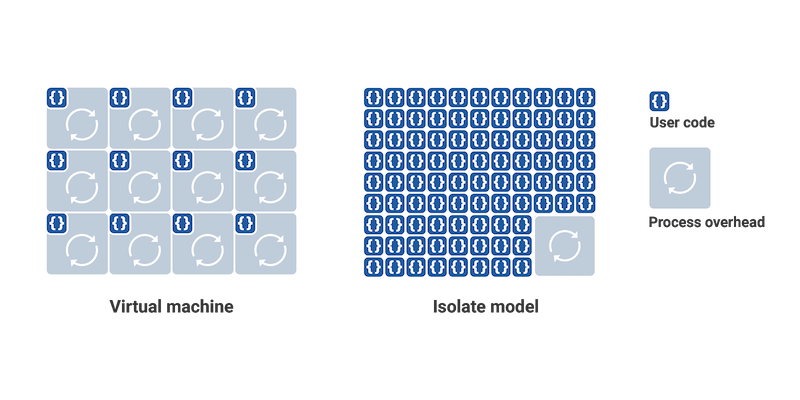

The evolution of computing paradigms has been a journey toward greater efficiency, scalability, and abstraction. From physical servers to virtual machines, and then to containers, each shift has aimed to optimize resource utilization and simplify deployment. Today, isolates are emerging as an innovative approach that builds upon and refines the containerization model.

**Isolates** are lightweight execution contexts that provide a secure, isolated environment for code execution within a shared runtime. Developed as part of the Chrome's V8 JavaScript engine, isolates offer a sandboxed space where functions can run independently, without interference from other processes. This makes them particularly well-suited for serverless architectures and edge computing.

In this article, I'll explore the architectures, performance characteristics, security models, and real-world applications of both isolates and containerized processes. By examining these aspects in detail, we can better understand their respective strengths and use cases in modern computing environments.

### Containerized Processes

Containers are technologies that allow the packaging and isolation of applications with their entire runtime environment. By encapsulating an application and its dependencies, containers ensure consistent performance across different environments. In essence, they are a form of operating system-level virtualization, allowing multiple applications to run in isolated spaces while sharing the same OS kernel.

> _**A virtual machine**_. is a piece of software that emulates a complete computer system, running its own operating system and kernel in isolation from its host machine. While virtual machines offer another way to host multiple environments on a single server, they consume significantly more resources than containers.

While containers offer several key advantages, including portability across any system supporting the container runtime, resource isolation between applications, easy horizontal scalability for handling increased loads, and consistent environments that eliminate deployment inconsistencies, they also face notable limitations. These include resource overhead from maintaining separate libraries and dependencies, significant startup times ranging from seconds to minutes that can impact performance-critical applications, operational complexity requiring orchestration tools like Kubernetes, and security risks where kernel-level vulnerabilities can affect all containers sharing the host OS.

### Introducing Isolates

While containers offer many benefits, their limitations, as illustrated in the previous section, have led to alternative approaches, particularly isolates as implemented in Chrome's V8 engine - Google's JavaScript engine (named like the eight-cylinder engine) that can execute code both within and outside of browsers. This flexibility, combined with V8's isolate architecture, provides enhanced resource efficiency, faster startup times, more granular isolation for better security, and improved scalability, making it a compelling alternative to traditional containerization.

V8's runtime can manage thousands of isolates, switching between them seamlessly while maintaining complete memory isolation between each piece of code. This isolation ensures protection from untrusted or user-written code within the same runtime. Unlike virtual machines that require a complete environment setup, isolates are created within an existing environment, enabling extremely fast startup times and eliminating the cold starts typically associated with virtual machines.

The figure contrasts two approaches to running code: containerized processes and V8 isolates. In containerized processes, each instance requires its own language runtime, creating significant overhead. V8 isolates take a different approach - the V8 engine pays the runtime overhead only once at startup, after which it can execute hundreds of thousands of isolated scripts with minimal individual overhead. This architecture enables isolates to start approximately a hundred times faster than containerized Node processes, while consuming an order of magnitude less memory at startup.

#### V8's Fine-Grained Sandboxing

A sandbox provides an isolated execution environment where software runs independently from other processes on the same machine. This isolation is a fundamental feature of Chrome's V8 engine, enabling secure and efficient code execution through a sophisticated sandboxing architecture.

V8's approach to sandboxing stands out from traditional solutions:
- Unlike enterprise sandboxing products that rely on isolated virtual machines, V8's implementation maintains high performance
- Each process operates in its own sandbox, ensuring complete separation of JavaScript functions
- Memory isolation prevents code execution in one sandbox from affecting others

While V8 provides the foundation for various JavaScript runtimes, it's important to understand how other environments build upon it. **Node.js**, for example, is built on the V8 engine as a runtime environment for JavaScript, offering asynchronous execution capabilities and sharing V8's open-source nature. However, it notably lacks V8's built-in sandboxing features, distinguishing it from its underlying engine.

> A runtime environment is the software infrastructure where code executes. While Node.js uses the '.js' extension to denote its JavaScript association, this is purely nomenclature and doesn't indicate a JavaScript file.

### Compute Per Request Solutions
Compute Per Request has emerged as an innovative paradigm that addresses these modern computing challenges by allocating resources dynamically for each incoming request. This approach proves especially valuable in serverless and edge computing environments, where minimizing latency and optimizing resource usage are critical.

Unlike typical containerized processes that require separate runtime environments, isolates provide lightweight, sandboxed execution contexts within a shared runtime. This architecture enables platforms to process requests with significantly reduced overhead, faster startup times, and more efficient resource utilization.

Modern edge computing platforms have embraced isolates as an efficient solution for per-request computation. These platforms offer several key advantages over traditional containerized approaches: Cloudflare Workers, Deno Deploy, and Fastly Compute@Edge all use isolate-based Compute Per Request solutions offer compelling advantages over traditional containerization approaches. These platforms demonstrate how the isolate architecture enables sub-millisecond execution times and high-density computing, making them particularly well-suited for modern edge computing demands.

### Conclusion

Isolates represent an innovative evolution in code execution paradigms, particularly as implemented in Chrome's V8 engine. While containers remain valuable for many use cases with their benefits of portability and consistent environments, isolates offer a compelling alternative for scenarios requiring rapid startup times and efficient resource utilization. As computing continues to evolve, especially in serverless and edge computing contexts, understanding and leveraging the strengths of both approaches will be crucial for optimizing application performance and resource usage.

<small>References: <a href="https://v8.dev" target="_blank">Chrome's V8</a>; <a href="https://developers.cloudflare.com/workers/reference/how-workers-works" target="_blank">Cloudflare Workers</a>; <a href="https://www.cloudflare.com/en-gb/learning/serverless/glossary/what-is-chrome-v8/" target="_blank">What is Chrome's V8</a>
</small>