I remember building [Debugr](https://github.com/abayomipopoola/Debugr), an agentic coding tool, before Claude Code became mainstream.

Fast forward to today, and LLMs have become powerful enough that I felt I had to show what is now possible, especially around something I've always been fascinated by: running them locally. _Intelligence in a box_. Your data stays on your machine, and it costs almost nothing to run, apart from your power bill. Power isn't free.

After seeing what _Fable_ could do on fairly complex projects, I decided to use it to solve a small frustration of mine: local LLM apps were either too closed, too dependent on someone else’s model catalogue, or too focused on one workflow. What I wanted was simpler: download an app, pick a local model, import another one when needed, and chat without standing up a server or waiting for someone else to approve the next interesting model.

There are plenty of other ways to run models locally: _Ollama_, _llama.cpp_, _vLLM_, or _mlx-lm_. I just wanted the experience to feel more like an app: open it, pick a model, and chat.

The result is **MLX Chat**: a native macOS chat app for running LLMs fully on-device.  
Download the signed dmg from the [_website_](https://mlxchat.dev/) or build it from [_source_](https://github.com/abayomipopoola/mlx-chat).

### The shape of the thing

Every system has one idea that holds it together. For MLX Chat, it is this: _one model in RAM at a time, behind one interface._

Everything else follows from that decision. Models are downloaded only when needed, loaded only when needed, and unloaded before another takes their place. Whether the response comes from an MLX model or Apple's built-in foundation model, the UI talks to both through the same interface. As far as the app is concerned, a model is just something that can stream a response.

That separation kept the app surprisingly simple. Features like streaming, thinking blocks, model switching, and Apple Intelligence all fit into the same flow without the UI caring which engine was doing the work.

If you're curious about how that is wired together, including the runtime, state machine, and model lifecycle, I've documented the architecture in the project's [_readme_](https://github.com/abayomipopoola/mlx-chat/blob/main/README.md#architecture).

Two very different technologies make that diagram work.

**MLX** does the heavy lifting for local models. It loads quantised models directly into Apple Silicon's unified memory and keeps enough state around that the model does not have to rebuild the entire conversation every time you send a message. The result is a chat experience that feels far more responsive than repeatedly starting from scratch. Behind the scenes, the runtime only rebuilds a session when it has to and aggressively releases memory when a model is unloaded.

**Apple Intelligence** takes almost the opposite approach. The model is already managed by the operating system, so there are no weights to download or memory to juggle. The app simply asks the system for a response and streams it back into the conversation. The entire engine is remarkably small because macOS does most of the heavy lifting.

### A functional UI, and the cool bits

Around that core is a proper Mac app rather than a proof of concept.

There's custom window chrome with a flat, resizable sidebar with chat history, streaming responses with collapsible thinking blocks, markdown with syntax highlighting and LaTeX, and live HTML and SVG previews rendered directly inside the conversation. It also includes prompt presets for General, Creative, Roleplay, Coding, Reasoning, and Custom, a global temperature control, tokens-per-second metrics, and a model manager for downloading, importing, and managing local models.

Two features are the ones I'm especially fond of.

**Apple Intelligence, out of the box.** Launch the app on macOS 26+ and you can start chatting immediately. No downloads. No setup. Because the app uses the system model, improvements in future macOS releases simply become free upgrades. Same app, smarter brain.

**Auto-Unload After.** A 12 GB model you stopped using at _2 PM_ shouldn't still be occupying 12 GB of memory at _5 PM_. Idle models are automatically unloaded after a configurable timeout, reclaiming memory before quietly reloading the next time you chat.

It's the feature nobody demos, but everybody's Activity Monitor appreciates.

### Why this matters

The point of MLX Chat is not that everyone should run every model locally. Hosted models are still more powerful, easier to update, and better suited to many serious workloads. But local models change the relationship a little.

You do not ask permission to try a model. You do not send a private thought to a server just to see what a model thinks about it. You do not need an account, a quota, or a billing dashboard before you can experiment. The machine in front of you becomes enough.

That is what makes on-device intelligence interesting to me. Not because it replaces everything else, but because it gives the user back a small piece of control. The models may be smaller than what runs in the cloud, but they are yours in a way most AI products are not.

The best local AI app is not the one that reminds you how clever the technology is. It is the one that makes local intelligence feel ordinary.

<small>References: MLX Chat draws inspiration from Locally AI for its simplicity and MLX Studio for its polished MLX experience, while taking a more open approach to model management. 
Download the signed dmg from the [_website_](https://mlxchat.dev/) or build it from [_source_](https://github.com/abayomipopoola/mlx-chat).
</small>
