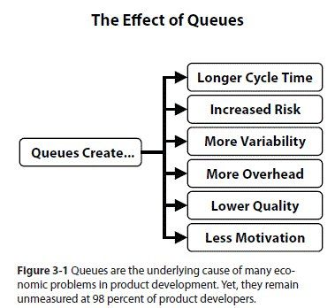

This is the concluding part of the _The Principles of Product Development Flow_ blog post.

### Managing Product Development Queues

Queues are everywhere in product development. The waiting lists or backlog of tasks or items that need to be completed or processed, list of bugs to be fixed, features to be added, or requests to be addressed.

Queues are an integral part of product development because they help teams prioritize work and manage their workflow. When new tasks or items are added to the queue, they are typically assigned a priority based on their importance and urgency, and this helps team members decide what to work on next.

One common use of queues in product development is in Agile software development methodologies. In Agile, work is typically organized into short iterations called sprints. During each sprint, the team works on a prioritized backlog of tasks, which is essentially a queue of work items. The backlog is constantly evolving, with new items being added and others being completed, and the team adjusts their priorities accordingly.

Queues are an essential tool for managing the complex and ever-changing workflow of product development. They help teams stay organized, focused, and productive, which ultimately leads to better products and happier customers.

#### Queueing theory

Queueing theory is a mathematical approach to the study of waiting lines, and it provides a framework for understanding the behaviour of systems that involve waiting in line, such as banks, grocery stores, and call centers.

The queue refers to the line of customers waiting to be served. The length of the queue and the waiting time of customers in the queue can be influenced by various factors, such as the arrival rate, the service rate, and the number of servers available.

Queueing theory provides a way to analyze the performance of a queue systems and to identify ways to optimize them, such as by increasing the number of servers, improving the service rate, or reducing the arrival rate. The principles of queueing theory can be applied to a wide range of systems and are used in various fields, such as operations research, computer science, and engineering.

> The arrival process in a queueing system describes how customers or requests enter the queue. Various models can represent it, including the Poisson process, where customer arrival is a random event that conforms to a particular probability distribution.

#### Queues and Product Development

Product developers have an idea that if people work all the time, product features get delivered faster. A common misconception is that high utilization leads to faster delivery of product features. However, this approach can often result in overloading the system, leading to bottlenecks and delays.

In a product development process, work can be thought of as a series of tasks that move through the system, similar to a queue. However, unlike a physical queue, the work queue in product development is often invisible and harder to measure. This makes it more difficult to manage and optimize the flow of work. When the work queue grows without proper management, it can result in long wait times, reduced throughput, and lower overall efficiency. This is because, in a product development process, work is often dependent on other tasks and resources, leading to complex interdependencies and bottlenecks.

To avoid these issues, product developers need to focus on managing the work queue and optimizing the flow of work. This can be achieved by using flow management techniques such as limiting work in progress, prioritizing work based on customer value, and implementing pull systems to ensure that work is only started when it is needed. By managing the queue, product developers can ensure that work moves smoothly through the system, leading to faster delivery of product features and improved overall efficiency.

> Invisible and unmanaged queues are the root cause of poor economic performance in product development.

Queue management is a critical aspect of product development and can have a significant impact on the overall efficiency and effectiveness of the process. Borrowed metrics from lean manufacturing: lead time, cycle time, wait time, and throughput, are all interrelated and are used to measure the flow of work through the system.

By managing queues and reducing wait times, organizations can improve the flow of work and ultimately reduce the overall lead time and cycle time. This, in turn, leads to faster delivery of products and services, higher customer satisfaction, and a more efficient use of resources. Queue management is also crucial in identifying bottlenecks in the process and addressing them, which can help organizations improve their overall performance and achieve their goals.

Cycle time is a crucial metric in product development as it provides valuable information on the time taken by the team to complete tasks, allowing for the identification of bottlenecks and areas for improvement. When used along with other metrics like defect density, unit test code coverage, and defect injection rate, cycle time provides a comprehensive view of the product development process and helps teams make data-driven decisions to optimize their workflows. Additionally, tracking cycle time can also help organizations understand their overall velocity and predict future delivery timelines with greater accuracy.

#### Capacity Utilisation

Underestimating the cost of queues in product development leads to process overloading. Queues affect capacity utilization: As queue size increases, we tend to apply more of our capacity to alleviate the situation. This increased capacity utilization reduces our flexibility.

Queues in a given process occur right before a step with limited capacity and/or high utilization (Product management, Engineering, QA). Capacity utilization is the single most important factor in the occurrence of queues. This is somewhat natural because when a process is run at 100% utilization, any new work would automatically sit on the "waiting" queue until someone has the free capacity to take it.

**The Queue Multiplier Effect**: Capacity utilization affects queue size exponentially, not linearly. This creates a powerful but often overlooked relationship:

- Increasing from 80% to 90% utilization → Queue size doubles
- Increasing from 90% to 95% utilization → Queue size doubles again
- Approaching 100% utilization → Queue size approaches infinity

This exponential relationship means small changes in utilization create dramatic changes in wait times. Since queue size directly determines how long each new job waits before being processed, your utilization target becomes a critical business decision:

- If fast response time is critical → Target lower utilization (70-80%)
- If maximum throughput is critical → Target higher utilization (85-95%)
- If both matter → Find the economic balance point for your specific context

This relationship explains why seemingly small increases in workload can suddenly cause system-wide delays that feel disproportionate to the change in input.

Also, it is important to note that queues are not always bad, and whether you should allow a queue of a given size to occur is an economical question (more on that in the next section). If an extra developer costs you _N_, but the potential delay of the project costs you _100 x N_, then it might be wise that you just get the developer and zero down the development queue. However, if you need to spend a lot of money to shorten the test cycle by one week and the benefit would be a mere pat on the back, then that shouldn't count.

If you have a process or a staff that affects the overall throughput of the system (bottleneck), you don't want any idle time for them. To make sure they always have something to work on, you deliberately build a queue right before them. This queue takes away the variation of arriving new tasks and ensures maximum throughput for your process.

**Strategic Queue Management in Practice:** 
Product management typically maintains a large queue of non-refined ideas collected from various teams. This queue represents significant potential value - many of these ideas could propel the company forward if properly developed. However, this value is only realized when product management has sufficient capacity to:

- Refine raw ideas into viable business cases
- Partner with engineering teams to implement them
- Validate results through customer feedback

When product management lacks capacity to process this queue efficiently, the organization suffers from:

- Missed market opportunities
- Customer churn when valuable feedback goes unaddressed
- Reduced innovation potential

This example illustrates why simply applying manufacturing-style FIFO (first in first out) queuing to product management can be a costly mistake. Unlike manufacturing, where units are often interchangeable, product development work varies dramatically in economic impact. The optimal strategy is to sequence work based on economic value and risk profile:

- Prioritize tasks with high cost-of-delay or significant opportunity cost
- For equally critical tasks, start with the shorter ones first
- Consider risk factors that might affect sequencing decisions

Queues have a profound affect the product development processes. They cause valuable work products to sit idle, waiting to access busy resources. Queuing theory is interested in the various qualities of a queue. Its importance within software engineering can not be understated. A team that does not manage its queues properly is running the risk of slow delivery, long cycle times and large batch sizes.

#### Cumulative Flow Diagram

The Cumulative Flow Diagram (CFD) is a visual tool that helps manage the product development queue. It is a graph that shows the flow of work items through different stages of a process over time. The CFD is especially useful in managing product development queues that involve multiple stages and parallel work streams.

The CFD displays the number of work items in each stage of the development process, from the beginning of the project to the present time. The vertical axis of the diagram represents the number of work items, while the horizontal axis represents time. The CFD typically includes separate lines or areas for each stage of the process, such as backlog, design, development, testing, and deployment.

One of the benefits of the CFD is that it can help identify bottlenecks in the product development process. Bottlenecks are stages of the process where work items tend to accumulate and get stuck. By identifying these bottlenecks, product managers can focus on improving the efficiency of these stages, which can improve the overall speed and quality of the product development process.

The CFD can also help product managers understand the overall flow of work items through the product development queue. By analyzing the trends in the CFD over time, product managers can identify patterns and make data-driven decisions about the prioritization of work items and the allocation of resources.

The chart above is an example of a CFD, where the x-axis represent the time frame that the chart is visualising the data for. The y-axis represent the cummulative number of work units that are in the work flow at the time of measurement.

The cumulative flow diagram is also a crucial Kanban analytics tool and provides an overview of the current state of your project.

Kanban is a popular approach to managing workflow that involves visualizing work on a board that is divided into columns. Each column represents a different stage of the workflow, and tasks move from left to right as they progress through the various stages. In a typical Kanban board, there are three columns: "To Do", "Work in Progress" (WIP), and "Done".

A cumulative flow diagram can be used to track the performance of a Kanban board and identify areas for improvement. The CFD displays the cumulative amount of work in each stage of the workflow over time. The shape and slope of the lines on the diagram can reveal valuable insights into the efficiency of the workflow.

By using a CFD to track the performance of a Kanban board, we can monitor several important metrics:

- **Cycle time**: This is the time it takes for a single task to move through the entire workflow, from "To Do" to "Done". By analyzing the slope of the line for the "Done" column, we can estimate the average cycle time for each task.

- **Work in progress (WIP)**: This is the number of tasks that are currently in progress within the workflow, represented by the height of the line for the "Work in Progress" column. By looking at the overall shape of the CFD, we can see how WIP levels fluctuate over time and identify periods of high or low utilization.

- **Throughput**: This is the number of tasks that are completed within a given period of time, represented by the steepness of the overall slope of the CFD. By measuring the throughput of the workflow, we can estimate the overall efficiency and productivity of the team.

By collecting and analyzing these metrics over time, we can identify trends and patterns in workflow performance and make informed decisions about how to improve processes and optimize performance.

#### How To Read a Cumulative Flow Diagram: A Visual Guide

The cumulative flow diagram (CFD) reveals the stability of your process over time by tracking each task through your workflow stages.

**Basic CFD Structure:**

- Each colored band represents a workflow stage
- The width of each band shows the number of items in that stage
- The x-axis represents time
- The y-axis shows the cumulative number of work items

**Understanding Arrival and Departure:**

- Each stage has both an arrival line (top) and departure line (bottom)
- The vertical distance between these lines shows how many items are currently in that stage
- Widening bands indicate growing queues in that stage

**Measuring Cycle Time:**

- The horizontal distance between the first stage (intake) and last stage (completion) represents average cycle time
- This visualization makes it easy to see how long tasks typically take to flow through your entire process

**Reading a Real Example:**

This example shows a software team's five-stage workflow:

Requested to start → Design → Development → Review → Done.

Notice:

- The approximate two-week cycle time from request to completion
- The relative sizes of queues in each stage
- The total number of completed tasks over the period

**Evaluating Process Stability:**

A stable process shows parallel growth between arrival and departure lines. In this example, work is flowing smoothly through the system.

**Detecting Problems:**

When bands expand rapidly (especially in the middle stages), it signals that items are arriving faster than they can be processed - a warning sign requiring immediate action.

**Key CFD Principles:**

- A proper CFD always flows upward or sideways - never downward (tasks don't disappear)
- Thinner "In Progress" bands indicate smaller batch sizes and typically faster cycle times
- Consistent band widths suggest a stable, predictable process

When the "In Progress" bar appears thinner, the team is working on smaller batches of tasks, which means they have less "Work in progress" (WIP). By working on fewer tasks at the same time, the team can concentrate better and create more value through the system. In the second diagram, if you imagine the same vertical and horizontal lines, you'll see that having a smaller queue size has resulted in less delay.

#### How do we lower "Work In Progress"?

Pair programming and code reviews are methods that enable engineers to manage their work in progress (WIP) more effectively. By collaborating to tackle complex tasks, there are several additional benefits that arise.

Firstly, the quality of the code generally improves due to more thorough scrutiny and debate by multiple individuals. Secondly, silos are prevented from forming as individuals share their knowledge and understanding of their contribution with others. Thirdly, coaching becomes easier as engineers can pair up with those who have complementary skills, resulting in a more well-rounded team.

This approach builds resilience into the software engineering system without requiring restrictive WIP constraints such as limits on the number of tasks in progress.

By managing our WIP and being mindful of our queues, we remove constraints on flow. By removing constraints on flow, we unlock the team's ability to pivot quickly without suspending good engineering practice. This property is and always will be, at the very heart of an agile culture and a necessary ingredient in the success of an organisation's software engineering effort.

### Conclusion

The principles of product development flow are designed to optimize flow and improve the efficiency of the product development process. By understanding concepts like Little's Law, queueing theory, flow management, work-in-progress limits, pull systems and flow metrics, organizations can take steps to eliminate bottlenecks in their development process and improve the flow of their development process. This leads to faster time to market, better quality products, and increased customer satisfaction.

I strongly recommend reading "The Principles of Product Development Flow" by Donald Reinertsen as it is an excellent book.

<small>References: <a href="https://www.amazon.com/gp/product/1935401009" target="_blank">The Principles of Product Development Flow by Donald Reinertsen</a>; <a href="https://kanbanize.com/kanban-resources/kanban-analytics/cumulative-flow-diagram" target="_blank">Cumulative Flow Diagram</a>; <a href="https://support.atlassian.com/jira-software-cloud/docs/view-and-understand-the-cumulative-flow-diagram/" target="_blank">View and understand the cumulative flow diagram</a>
</small>
