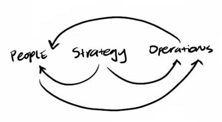
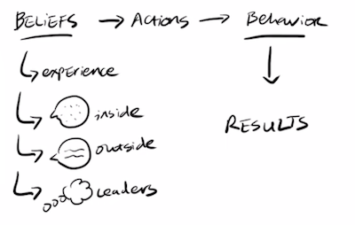
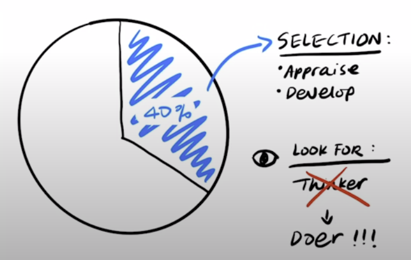
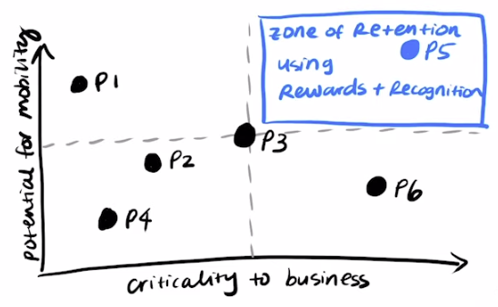
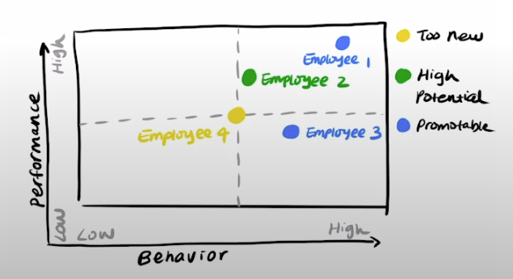
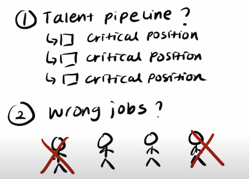

In **Execution: The Discipline of Getting Things Done**, Ram Charan and former Honeywell CEO Larry Bossidy explore leadership techniques. They spotlight the significance of hiring individuals who not only execute tasks but also inspire colleagues, make swift decisions, delegate effectively, and ensure accountability. For business leaders to succeed, they should deeply understand markets, customers, and resources. Moreover, they should lead the strategic process, leverage the operations process when creating new programs, and correlate performance with incentives. These three cornerstones serve as the foundation for a competitive edge.

For effective execution, leaders need to be deeply engaged within their teams and organizations. Cultivating a culture of execution ensures systematic evaluation of the current state and taking the necessary measures.

### The Principle of GTD

Leaders need to be proactive, working closely with their teams. To implement effective core processes, they should instill vital leadership behaviors and foster an execution culture. The three core processes of execution intricately weave together an organization’s people, strategy, and operations.

- **Strategy Plans**: Should consider personnel and operational factors.
- **People**: Must align with strategic and operational objectives.
- **Operations**: Need to connect with strategic goals and human abilities.

Crafting an execution culture resonates with the <a href="https://www.investopedia.com/terms/s/six-sigma.asp" target="_blank">_six sigma_</a> continuous improvement approach. Leaders should always be on the lookout for deviations in execution, from profit margins to promotions, and swiftly address them, elevating the organization’s standard. Execution, like Six Sigma, requires persistent application.

### Execution Culture

Changing a company’s culture is challenging. Most attempts fall short because they’re not tied to business results. Typically, it’s not values that need changing, but limiting beliefs influencing behavior. Behaviors spring from beliefs rooted in experiences, external opinions, and perceptions about leaders. If employees perceive that low performers receive equal rewards, motivation dwindles.

#### Four steps to a culture of execution

A business culture ultimately tells the people in the organization what kinds of behaviors are valued and rewarded. The compensation system must reward not just substantial achievement on numbers but also desirable behaviors that people adopt.

There are four steps to create a culture of execution.

1. **Promote Transparency**: _Be transparent with your team about what results are needed_. A vital part of the organizational software is “Social Operating Mechanisms,” which include any place where dialogue occurs in an organization. Social Operating Mechanisms could be formal or informal meetings, emails, presentations etc. Social Operating Mechanisms cut across functions, disciplines, work processes and hierarchies. They create new information flows, working relationships and improve transparency and collective action. Social Operating Mechanisms are critical to share the leader’s behaviors, beliefs and mode of dialogue throughout the organization. Other leaders who are present adopt these as their mode of operation.

2. **Provide Guidance**: _This can be done through robust dialogues_. These candid and open dialogues improve the organization’s ability to gather information, process it and make decisions. Informality encourages questions, helps colleagues take risks and surfaces out-of-the-box ideas.

3. **Recognize Achievements**: _Reward people for positive results_. A business culture ultimately tells the people in the organization what kinds of behaviors are valued and rewarded. The compensation system must reward not just substantial achievement on numbers but also desirable behaviors that people adopt.

4. **Address Shortcomings**: _If people come up short, coach them, withdraw rewards, offer other jobs or let them go_ Employees need a small number of clear priorities to execute well. When you speak to employees, emphasize only three or four key priorities that will influence the overall company performance. They have to make daily trade-offs because there is competition for resources and ambiguity over decision rights. Without carefully thought-out priorities, people can get caught up in endless conflicts.

### Hiring & Retention

The best long-term competitive differentiator is the quality of an organization’s talent pool. Leaders need to spend up to 40% of their time and emotional energy in the selection, appraisal and development of people. While a CEO may not interview every leadership candidate, employees will follow the standard set by the CEO for hires across the organization.

In building a culture of execution, prioritize hiring _doers over thinkers_. While visionary thinking is valuable, execution is paramount. Seek candidates who demonstrate a passion for execution rather than mere intellectual musings–prioritise candidates who display energy and enthusiasm for execution instead of just abstract ideation.

Qualities to Seek in Candidates:

- **Energizing Presence**: _They should motivate and inspire colleagues_. Hire candidates who energize their fellow employees.
- **Decision-making Prowess**: _They should address complex issues swiftly_. Choose candidates with the emotional fortitude to decide on complex issues swiftly and act on them.
- **Teamwork**: _They should amplify team capabilities without overburdening_. Leaders who cannot get work done through others put in 80-hour weeks and push their team to do the same. If a candidate cannot get things done through others, they are sure to burn out.
- **Commitment**: _They must consistently follow through on tasks_. Follow through ensures that people do the thing they have committed to do on time. Never finish a meeting without follow-throughs.

#### Retention Risk Analysis

Once you’ve hired the right team to form your company culture, you need them to stick around. How do you make sure you retain your top talent? In the 1990s, General Electric (GE) - heralded for nurturing leadership talent - addressed this challenge. When their top talent became a retention risk, they employed swift retention strategies. For instance, they offered long-term financial incentives such as stock grants, which could only be redeemed upon retirement. Furthermore, GE’s depth in succession planning meant they could replace any critical departures within a day.

**Retention Risk Analysis** focuses on gauging an individual’s likelihood to leave and the potential impact their departure would have on the organization. If an employee is deemed essential and likely to depart, measures like recognition and rewards are employed to keep them onboard. In tandem, _Succession Depth Analysis_ assesses the organization’s readiness to fill pivotal roles. This dual approach ensures both preemptive retention and preparedness for unplanned exits.

#### Promotion & Transition

A robust evaluation process is crucial in determining potential leaders and those who may need redirection or even termination.

- **Leadership Assessment Summary** is a matrix with performance and behavior as axes, both with a scale of low, medium and high. The Leadership Assessment Summary gives an overview of candidates who are high-potential and promotable. Similarly, it shows those who exceed performance standards but need coaching on behavior and vice-versa.

- In constract, a **Succession Depth Analysis** evaluates if the company has the talent pipeline to fill critical positions. It also evaluates if high-potential people are stuck in the wrong jobs.

Both processes work together to distinguish between candidates who need to be moved to lesser jobs and those who need to be fired. When you have to let people go, it’s best to do it with as much dignity as possible. It reinforces the positive nature of the performance culture.

### Seven Essential Leadership Behaviors

Leaders play a pivotal role in shaping an organization’s execution culture. Here are seven critical behaviors for such leaders:

1. **Know your people and your business**: Leaders must make an effort to engage with their staff actively and have candid discussions on operational realities. A leader who asks superficial questions at significant and casual interactions leaves the team with a sense that said leader is clueless. In contrast, a leader who actively discusses operational realities shares the organizational vision and opens a space for candid conversation, which earns the team’s respect.
2. **Insist on Realism**: Leaders have to be realistic and ensure that realism is the goal of all dialogues in the organization. An excellent way to start is to ask employees frequently, “What are we doing right, and what are we doing wrong as a business?”
3. **Set Clear Goals and Priorities**: Focus on a few clear priorities that can produce the best results from the resources at hand. Well-thought-out priorities can help people make better trade-offs between priorities daily and avoid organizational politics.
4. **Follow Through**: Ensure accountability and create follow-through mechanisms to ensure that everyone does what they are supposed to do. Regular follow-through meetings send the signal throughout the company that others can expect follow-through on tasks from each other.
5. **Reward the Doers**: Performers must get a better bonus, stock options or even stock grants. A leader needs to ensure that distinctions based on performance become a way of life through the organization.
6. **Coach to Expand Capabilities**: Leaders must regard every encounter as an opportunity to coach their people. Provide specific feedback and point out behavior and performance that require changes. Do not preach. Ask incisive questions that bring out the reality of a situation and give stakeholders the help they need to correct problems.
7. **Know Yourself**: Emotional blockages result in conflict evasion, procrastination on decisions and failure to deal with underperformers. Build emotional fortitude to be honest with yourself, accept opposite points of view and give people honest assessments. Leaders earn confidence when followers can see their inner strength, confidence, ability to help others deliver results, and efforts to expand their capabilities.
   - Four core qualities make up emotional fortitude: _authenticity_, _self-awareness_, _self-mastery_ and _humility_.

<small>References: <a href="https://youexec.com/book-summaries/execution-the-discipline-of-getting-things-done?r=yt" target="_blank">You Exec’s book summary</a></small>
