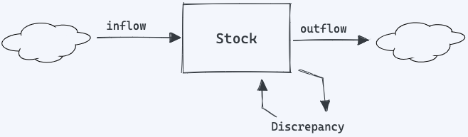
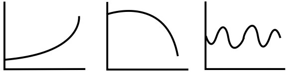

**Thinking in Systems: A Primer**, is a groundbreaking book authored by the late Donella Meadows, an acclaimed environmental scientist, and systems analyst. The book, published posthumously in 2008, provides an accessible introduction to the field of systems thinking—a holistic approach to understanding the complex interconnections between components of a system. Donella's work has had a profound impact on various disciplines, including environmental science, economics, and public policy.

This post provides a comprehensive introduction to the book and its central ideas, followed by a brief overview of systems thinking.

### Systems

Donella introduces the concept of _systems_ as a central tenet of systems thinking. A system is defined as a set of interconnected components that work together to achieve a specific purpose or function. Systems can exist in various contexts, such as natural ecosystems, organizational structures, social networks, and technological infrastructures. They can range from simple to highly complex, and their components can be either tangible (e.g., objects, people) or intangible (e.g., information, relationships).

> _**A system is more than the sum of its parts**_. It may exhibit adaptive, dynamic, goal-seeking, self-preserving, and sometimes evolutionary behavior.

Donella emphasizes that systems are more than just the sum of their parts; it is the interconnections and interactions between components that give rise to the system's overall behaviour. To understand a system, one must not only consider its individual components but also the relationships between those components and how they contribute to the system's overall function.

One of the key insights from _Thinking in Systems_ is that systems exhibit certain properties and behaviours that cannot be deduced by simply examining their individual components in isolation. These emergent properties arise from the system's structure and the interactions between its components. For instance, a traffic jam is an emergent property of the transportation system, resulting from the interactions between vehicles, roads, and traffic control measures.

By adopting a systems perspective, we can develop a more comprehensive understanding of complex phenomena, enabling us to better identify underlying issues, anticipate potential problems, and design more effective solutions. Systems thinking encourages us to think holistically, considering not just the individual components but also the interconnections, feedback loops, and dynamics that shape the behaviour of the system as a whole.

#### Three constituents of a Systems

Systems can be broken down into three fundamental constituents: elements, connectors, and purposes. Understanding these constituents is essential for analyzing and managing complex systems effectively.

- **Elements**: Elements are the individual components or parts of a system. They can be tangible (e.g., people, objects) or intangible (e.g., information, ideas). In a software system, for example, elements could include code modules, databases, and user interfaces.

- **Connectors**: Connectors are the relationships, interactions, or connections between the elements within a system. These can take various forms, such as data flows, communication channels, or dependencies. Connectors are critical to a system's functioning, as they enable the transfer of information, resources, or influence among its components. In the software system example, connectors could be API calls, data exchange protocols, or function calls within the code.

- **Purposes**: The purpose of a system refers to its overarching goal, function, or reason for existence. It is the driving force behind the system's behaviour and the ultimate objective that its components collectively strive to achieve. Understanding a system's purpose helps clarify the context in which it operates and provides a foundation for evaluating its performance and effectiveness. In the software system example, the purpose could be to process and analyze data, facilitate communication between users, or manage an organization's resources.

By analyzing these constituents, we can develop a more holistic understanding of complex systems and improve our problem-solving and decision-making capabilities.

### System Dynamics

The author provides an overview of system dynamics as a methodology for understanding the behaviour of complex systems over time. System dynamics focuses on the relationships, feedback loops, and interdependencies among different elements within a system, enabling us to analyze and predict system behaviour more effectively. I will go over some key aspects covered in the book.

#### Stocks and Flows

Donella introduces the concept of stocks and flows as fundamental components of systems thinking. These concepts help us understand the structure and behaviour of systems by breaking them down into their basic components and interactions.

The diagram above illustrates a bathtub model, which is a useful example used in the book to help us understand the dynamics of a system.

In this context, a stock represents a static snapshot of the system, while the arrows symbolize the changing dynamics that collaborate to maintain the system's balance. If the stock of a bathtub refers to the volume of water it holds, then the inflow could be represented by the faucet, and the outflow by the drain. The stock at any given moment is a result of the previous interactions between inflow and outflow, demonstrating the interconnected nature of system components.

**Stocks** represent the accumulations or quantities of resources, information, or any other measurable aspect within a system. They are the "state variables" that capture the system's current condition at a particular point in time. Stocks can be tangible (e.g., water in a reservoir, population in a city) or intangible (e.g., knowledge, goodwill). They change over time as the result of the inflows and outflows that impact them.

In systems thinking, stocks are crucial as they help to define the system's boundaries and serve as the basis for understanding its dynamics. The behaviour of stocks often depends on the system's feedback loops, which connect stocks and flows in a self-regulating manner.

**Flows** are the rates at which resources or information move in or out of stocks. Inflows add to a stock, while outflows subtract from it. Flows are the actions or processes that drive the system's behaviour and are responsible for the changes in stock levels over time. They represent the interactions and transfers between different components of a system.

Flows can be influenced by various factors, such as external forces, feedback loops, or changes in other system components. By analyzing flows, we can identify the factors that affect stock levels and the system's overall behaviour, enabling us to devise strategies to manage or influence the system effectively.

##### One-Stock and Two-Stock systems

The author does not explicitly use the terms _one-stock system_ and _two-stock system_ to categorize systems. However, the book does discuss systems with varying numbers of stocks and their interactions. The one-stock and two-stock systems is a derived example based on the concepts presented in the book.

One-stock and two-stock systems are not about the intrinsic nature of a system; instead, they relate to the focus of analysis. When working with models, it is often beneficial to reduce complexity, similar to measuring two variables at a time in <a href="/simple-explanation-of-regression-analysis" target="_blank">regression analysis</a>. As more stocks are added to a system under simultaneous analysis, the model becomes increasingly complex.

- **One-stock system**. In a one-stock system, there is a single stock influenced by one or more inflows and outflows. The bathtub analogy mentioned earlier is an example of a one-stock system, where the stock is the water in the bathtub, the inflow is water coming from the faucet, and the outflow is water draining away. This simple model helps convey the basic concept of stocks and flows and how they affect the stock's accumulation or depletion over time.

  - Example: Using the bathtub model, the stock in this example is the water in the bathtub. The inflow is the water coming from the faucet, and the outflow is the water draining out. The system's behaviour depends on the balance between the inflow and outflow rates, which determine the water level in the bathtub.

- **Two-stock system**. A two-stock system involves two interconnected stocks, each influenced by their respective inflows and outflows. In this model, the outflow from one stock may serve as the inflow for the other stock. For example, imagine two interconnected bathtubs, where water flows from the faucet into the first bathtub (Stock A) and then drains into the second bathtub (Stock B) before finally draining out of the system. This model demonstrates how multiple stocks can interact and how the dynamics of one stock can influence the behaviour of another stock within a system.

  - Example: Though not explicitly labeled as a two-stock system in the book, the predator-prey relationship is an example of such a system. In this case, the two stocks are the populations of predators and prey. The interactions between these two stocks form a feedback loop. When the prey population increases, the predator population benefits and grows, which then leads to a decrease in the prey population due to increased predation. This reduction in prey then causes the predator population to decline, allowing the prey population to recover. This cycle repeats itself, illustrating the interconnected nature of the two stocks and the feedback loops between them.

Understanding one-stock and two-stock systems, along with their interactions and feedback loops, is essential for grasping the behaviour of complex systems and managing them effectively.

#### Feedback Loops

Feedback loops are vital mechanisms within systems that either amplify (positive feedback) or stabilize (negative feedback) changes. Positive feedback loops drive growth or decline, whereas negative feedback loops maintain balance within the system.

Discrepancies in the system stock can lead to the activation of feedback loops to either amplify or counteract these discrepancies.

When a discrepancy arises in a system stock, such as an imbalance or deviation from a desired level, it can trigger feedback loops that act to correct or exacerbate the discrepancy.

- **Balancing feedback loops** (negative feedback): These loops counteract changes in the system, working to stabilize it or bring it back to a desired state. When a discrepancy occurs in a stock, a balancing feedback loop detects the difference between the current state and the desired state, and then acts to reduce this difference. For example, in a temperature control system, if the room temperature falls below the desired level, a thermostat activates the heating system to bring the temperature back up, thus closing the gap between the actual and desired states. Another example of a balancing feedback is monthly budget: the stock is your holding balance, and the inflow is your income, and the outflow is your monthly spending. In a situation where the stock, your holding balance, is less than you'd like it to be — a discrepancy in your goal and the state of your bank account, that'll lead you to change your outflow, spend less, which influence the stock, your balance.

- **Reinforcing feedback loops** (positive feedback): These loops amplify changes in the system, causing it to grow or decline more rapidly. When a discrepancy occurs in a stock, a reinforcing feedback loop can amplify the difference and lead to further divergence from the desired state. For example, in a population growth scenario, an increasing population leads to more births, which in turn further increases the population, creating a self-reinforcing cycle.

##### Behaviour-Over-Time Graphs

Behaviour-over-time graphs is used in the book as a way to visually represent the dynamics of systems and their response to feedback loops.

The charts above are called behaviour over time graphs. They provide clues to the kind of systemic processes that may be at work. A rapidly rising or falling graph, for example, indicates a reinforcing process, whereas an oscillating graph suggests what's called a balancing process.

behaviour-over-time graphs plot the changes in a stock or flow over time, revealing patterns, trends, or oscillations in the system's behaviour. These graphs can help identify the presence and effects of feedback loops within a system, as they make it easier to visualize the relationships between variables and how they change over time.

### Systems Limiting Factors

The author discusses limiting factors as elements or conditions within a system that constrain its behaviour or growth. These factors can act as boundaries, affecting the performance or potential of a system. Identifying and understanding limiting factors can help us manage systems more effectively and find ways to overcome or mitigate these constraints.

Here are some key aspects of limiting factors from the book:

- **Renewable and Non-renewable Resources**: One common limiting factor in systems is the availability of resources. For example, in an ecological system, the carrying capacity is determined by the availability of food, water, and other essential resources. In an economic system, natural resources like minerals, fossil fuels, or arable land may limit growth. Renewable resources, if managed sustainably, can support a system indefinitely, while non-renewable resources eventually get depleted, imposing limits on the system's growth or performance.

- **Balancing Feedback Loops**: Limiting factors often act through balancing feedback loops. When a system reaches its limits, balancing feedback loops come into play, working to stabilize the system or bring it back within its boundaries. For example, in a population growth scenario, limited food supply may lead to increased competition for resources, resulting in a decline in the population growth rate and ultimately stabilizing the population size.

- **System Structure**: The structure of a system can also impose limits on its behaviour or performance. These limits may arise from the arrangement of elements and their connections, or from the rules governing the system. For instance, the structure of a bureaucratic organization may limit its ability to adapt quickly to changes in its environment due to rigid hierarchies and decision-making processes.

- **Time Delays and Nonlinearity**: Time delays and nonlinearity within a system can impose limits on its behaviour or create unexpected outcomes. Time delays can cause oscillations, as the system may overreact or underreact to changes before the effects of previous actions are fully realized. Nonlinear relationships within a system may also lead to disproportionate responses, creating tipping points or thresholds beyond which the system's behaviour changes dramatically.

Recognizing and understanding limiting factors within a system is crucial for effective management and decision-making. By identifying these constraints and their effects on system behaviour, we can develop strategies to overcome or mitigate their impact, allowing us to better achieve our goals and improve the overall performance of the system.

### Resilience, Self-Organization and Hierarchy

Resilience, self-organization, and hierarchy are key characteristics that contribute to the effectiveness and functionality of systems.

Understanding these characteristics can help us better analyze and manage complex systems.

1. **Resilience**: Resilience refers to a system's ability to withstand shocks or disturbances and recover from them. A resilient system can maintain its functions and structure in the face of challenges, ensuring its long-term stability and sustainability. Meadows emphasizes the importance of resilience in both natural and human-made systems, as it allows them to adapt to changing conditions and survive potential crises. Resilience can be enhanced in a system through various means, such as:

   - _**Diversity**_: Systems with diverse components are often more resilient, as they can draw upon a range of responses to disturbances and adapt more effectively.
   - _**Redundancy**_: Having multiple, redundant elements that can perform the same function can increase a system's resilience, as it can continue to function even if some of its components fail.
   - _**Modularity**_: A modular system, where components are organized into semi-independent subunits, can be more resilient, as disturbances in one module are less likely to spread throughout the entire system.

2. **Self-Organization**: Self-organization is the ability of a system to organize and maintain its structure without external control or intervention. Self-organizing systems can adapt and evolve in response to changes in their environment, ensuring their continued functioning and survival. Meadows highlights the importance of understanding self-organization in complex systems, as it can lead to the emergence of new patterns, structures, and behaviours that may not be predictable or easily controlled. Self-organization can be encouraged or hindered by various factors, including:

   - _**Feedback loops**_: Positive and negative feedback loops within a system can influence its self-organization by amplifying or dampening changes in the system.
   - _**Rules**_: The rules governing a system, such as its decision-making processes or resource allocation, can either enable or constrain its self-organization.
   - _**Initial conditions**_: The starting conditions of a system can have a significant impact on its self-organization, as they can shape the patterns and structures that emerge over time.

3. **Hierarchy**: Hierarchy refers to the organization of a system into different levels or layers, with each level being composed of smaller subsystems and contributing to the functioning of larger super-systems. Meadows explains that hierarchy is a common feature of complex systems, as it allows them to manage information, allocate resources, and coordinate activities more efficiently. Understanding hierarchy in systems can provide insights into:

   - _**System behaviour**_: Analyzing the interactions between different levels of a hierarchical system can help us understand its overall behaviour and identify potential leverage points for intervention.
   - _**System vulnerability**_: Recognizing the vulnerabilities of a hierarchical system, such as the dependence on key components or the concentration of power at certain levels, can help us develop strategies to increase its resilience and stability.
   - _**System evolution**_: Examining the evolution of hierarchical structures in a system can provide insights into its adaptive processes and the factors that drive its development and change.

***

### System Thinking

In essence, systems thinking is an approach to understanding and discussing reality that enables us to effectively work with and influence systems to improve our lives. It serves as a perspective, a unique language for describing systemic behaviour, and a set of tools for visually representing and communicating about systems.

Systems thinking is a concept that has gained traction in recent years, particularly among decision-makers who seek to enhance the performance and outcomes of their initiatives. This approach involves analyzing an entity, comprised of interconnected components, as a whole, rather than focusing on individual parts. By doing so, decision-makers can identify the factors that contribute to or inhibit the success of interventions in complex areas such as business operations, organizational management, or addressing societal challenges.

#### System Thinking, Case Study

Consider Jon, senior manager at an urban planning organization. He is responsible for reducing traffic congestion in a rapidly growing city. His initial idea is to increase public transportation options to encourage people to use them instead of their cars. However, systems thinkers argue that focusing on a single solution (a 'part') without considering the broader context (the 'whole') could overlook crucial factors that influence its impact.

Traffic congestion is a product of a complex system, arising from the interaction of numerous factors such as city infrastructure, public transportation availability, land use patterns, population growth, and individual commuting habits. These factors range from personal choices to broader influences like urban development policies, economic incentives, and technological advancements. To effectively address traffic congestion, Jon must adopt a systems approach, recognizing that simple linear solutions will likely be inadequate.

As a senior manager, Jon can "zoom out" to examine how elements beyond a program's traditional boundaries, both within the organization and beyond, might influence the success of the program. By considering various interventions, policies, structures, patterns, and norms in the broader system, Jon can strategically identify leverage points that have the potential to facilitate and support changes in traffic congestion. Leverage points are places within the system that can be tweaked in a way that supports greater impact. For example, Jon might explore options to improve pedestrian and bicycle infrastructure or partner with businesses to encourage remote work.

Adopting a systems view will not only expand the boundaries of evaluation but also help Jon recognize the importance of diverse perspectives, values, and interrelationships throughout the system. While budget constraints might limit the scope of evaluation, Jon can still ensure that the evaluation provides strategic direction on effectively addressing traffic congestion. This may lead to recommendations for program improvements, new partnerships, or external policy changes.
By using a systems approach, Jon gains a better understanding of the external factors influencing the program's success and can set more reasonable expectations for its impact. He can also identify necessary changes both within and outside the program to maximize his organization's effectiveness.

Many now believe that a systems approach holds the most promise for addressing complex issues like traffic congestion, which is beneficial not only for Jon but also for everyone affected by the problem.

### Conclussion

_Thinking in Systems_ serves as a foundational text for understanding the principles and concepts of systems thinking. Donella Meadows masterfully presents these ideas in an engaging and accessible manner, making the book an invaluable resource for anyone seeking to grasp the intricacies of complex systems. By applying the concepts and insights presented in the book, readers can develop the skills necessary to analyze, design, and manage systems in a wide range of contexts.
