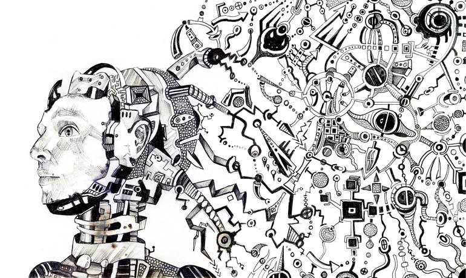

Just like programming a computer—as the program comes to the electrical computer from without; the same is true of each biological computers (the human brains): Purpose comes to it from outside its own mechanism.

> The mind programs the brain 🧠 .

One could posit that the mind is a separate but closely related element of the brain, contrary to the idea that it’s merely a function of the brain. This could be backed by with scientific findings that could be surmised, viz., in the brain there’s an amazing automatic sensory and motor computer that utilizes the conditioned reflexes—taking them as input signals for processing.

But humans are more than that...we possess some sort of a higher brain mechanism that is closely related to what we’ve come to know as consciousness or spirit or the mind.

The fact that you’re aware of spending time to read this article is simply what 'consciousness' is about.

Now that the mind can be seen as a separate—although still very related to the brain, perhaps changing ones mindset could be a way of reprogramming the brain (Google the ‘CIA MK ultra’ programme for a start...the whole cybernetics field of study and stuff are pretty mind boggling).

The mind though, must be a very powerful thing—having an energy of its own, that scientists can’t explain, yet.

###### Ref. image by saatchiart 